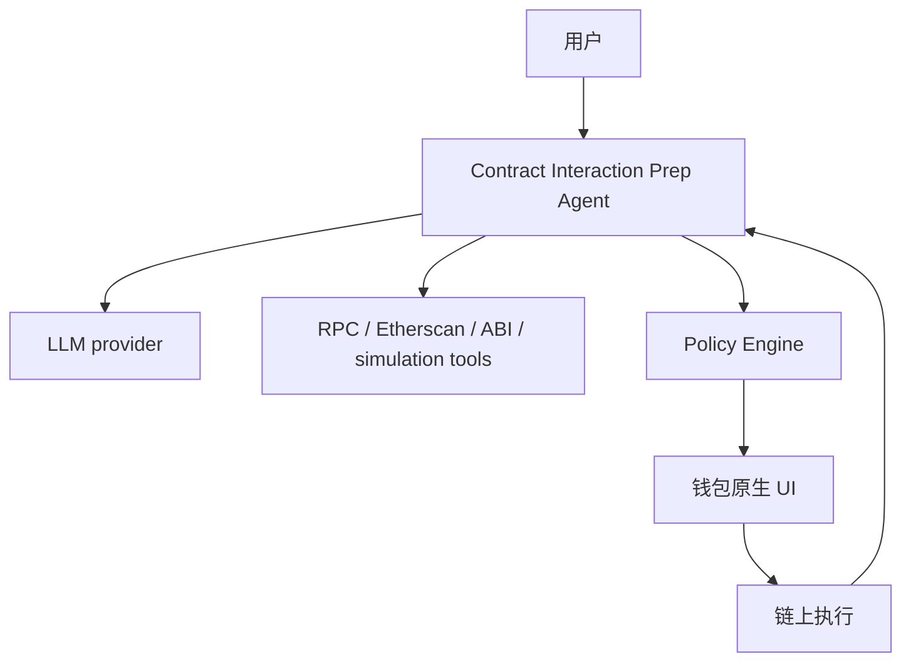

# Agent Profile 与能力声明草图

> 用途：Week 2 Module C `Agent Identity｜Agent Profile 与能力声明草图`
> 选择对象：一个我已经最熟悉、且和本周主方向一致的 agent workflow
> 名称：**Contract Interaction Prep Agent**

我没有选一个陌生的外部 agent，而是直接把本周已经连续推进的主线对象明确成一张 agent profile：

- Week 1 的 `contract-reader` 证明了“AI 可以帮用户读懂陌生合约”
- Module D 的 permission strategy 证明了“这个 agent 如果进一步参与链上动作准备，权限必须如何限制”
- Module F 的 threat model 证明了“即使有权限策略，工作流还会在哪些地方失效”

所以 Module C 这里，我正式把这条主线对象定义成：

> **Contract Interaction Prep Agent**  
> 一个不代签、不自动广播，但能帮助用户完成“理解合约 -> 准备交易 -> 风险检查 -> 进入钱包确认 -> 交易后验证”的 agent workflow。

---

## 1. Identity：它是谁

### 1.1 一句话定义

这是一个面向 Web3 用户与开发者的 **pre-execution agent**：

- 它的目标不是替用户交易
- 它的目标是把链上交互前最难、最乱、最容易出错的准备工作整理清楚

### 1.2 身份卡片

| 字段 | 内容 |
|---|---|
| `agent_name` | Contract Interaction Prep Agent |
| `agent_type` | Dev Tooling / Agent Workflow |
| `primary_role` | 合约交互前置准备助手 |
| `target_user` | 需要与陌生合约交互的普通用户、Web3 开发者、研究者 |
| `interaction_mode` | 用户主动调用，agent 返回结构化草稿与检查结果 |
| `trust_level` | 默认不可信执行，只可信“解释 / 草稿 / 检查 / 告警” |
| `execution_scope` | read / prepare / simulate / verify |
| `out_of_scope` | sign / broadcast / custody |

### 1.3 它由谁维护

| 角色 | 职责 |
|---|---|
| 产品 / 工作流维护者 | 定义系统提示词、风险清单、输出结构 |
| 工具层维护者 | 维护 RPC / Etherscan / ABI / simulation 接口 |
| 策略层维护者 | 维护授权对象、白名单、额度、阈值规则 |
| 用户自己 | 最终决定是否接受 agent 的建议，并在钱包中确认 |

换句话说，这个 agent 不是“自己自治的身份”，而是一个：

**由维护者提供能力、由用户在真实执行前握住最终决策权的 agent。**

---

## 2. Capability：它能做什么

### 2.1 能力声明

| 能力 | 说明 | 当前状态 |
|---|---|---|
| 合约阅读 | 读取源码、ABI、解释主要函数与风险点 | ✅ 已验证 |
| 结构化总结 | 把复杂合约与交易意图压缩成可读摘要 | ✅ 已验证 |
| 参数准备 | 把自然语言意图转成结构化调用草稿 | 🟡 已设计 |
| simulation / 静态检查 | 在不真实广播的前提下检查风险与执行可能性 | 🟡 已设计 |
| 权限检查 | 通过 task-level authorization object 判断是否越权 | 🟡 已设计 |
| post-trade verification | 对比 expected vs actual，输出告警 | 🟡 已设计 |
| 治理 / 审批联动 | 当前不作为主功能，但可接流程层 | ⬜ 非主线 |

### 2.2 不能做什么

为了避免身份漂移，这个 agent 需要明确写出“不做什么”：

- 不持有私钥
- 不直接控制 signer
- 不自动广播真实交易
- 不把 simulation 结果伪装成授权
- 不把“草稿结论”伪装成“最终判断”
- 不默默扩大预算、对象、链或 selector 范围

### 2.3 最核心的能力边界

> 它不是 execution agent，而是 **preparation agent**。  
> 它擅长的是解释、整理、检查、组织，而不是替用户完成不可逆链上动作。

---

## 3. 输入 / 输出（Inputs / Outputs）

### 3.1 输入

这个 agent 的典型输入包括：

| 输入类型 | 示例 |
|---|---|
| 自然语言意图 | “帮我看看这个合约能不能安全交互” |
| 合约地址 | 某个 ERC20 / router / airdrop 合约 |
| 交易意图 | “给白名单地址转 0.1 ETH” / “准备一次 exact approve” |
| 链信息 | Mainnet / Sepolia / 某个 L2 |
| 用户约束 | 预算上限、白名单地址、允许动作类型 |
| 当前任务上下文 | task-level authorization object、预期结果 |

### 3.2 输出

这个 agent 的输出不应该是“直接执行结果”，而应该是结构化草稿：

| 输出类型 | 示例 |
|---|---|
| 合约解释 | 一句话总结、主要函数、关键状态变量、风险点 |
| 调用草稿 | target、selector、参数范围、预算草稿 |
| 风险检查 | proxy 风险、spender 风险、预算风险、未验证点 |
| simulation 结论 | pass / fail / inconclusive |
| 权限判断 | allow / deny / escalate |
| 验证报告 | expected vs actual、事件日志摘要、异常告警 |

### 3.3 为什么输入 / 输出要这样设计

因为这个 agent 最值钱的地方不是“多说”，而是把输入和输出变成：

- 可复核
- 可追责
- 可传给下一层（钱包 / policy / 人工确认）

---

## 4. 协作对象（Collaboration Objects）

Module C 不只看单个 agent，还要看它跟谁协作。

### 4.1 直接协作对象

| 协作对象 | 作用 |
|---|---|
| 用户 | 发起任务、阅读输出、决定是否继续 |
| 钱包原生 UI | 提供最终待签名信息与人工确认入口 |
| Policy Engine | 负责授权范围判断 |
| 链上数据源 | 提供状态、回执、事件日志 |
| 源码 / ABI 工具 | 提供合约可读材料 |
| LLM provider | 提供解释、归纳、结构化输出能力 |

### 4.2 不是它直接协作但会影响它的对象

| 对象 | 为什么重要 |
|---|---|
| 后台 Agent（如 Hermes） | 可以负责 monitor / draft / alert，但不应接 signer |
| 多签 / Safe / 财务流程 | 如果后续接预算或治理流程，它们是更高层确认对象 |
| 治理流程 | 决定哪些操作只是建议，哪些需要进一步批准 |

### 4.3 协作关系图



---

## 5. 如何被调用（Invocation）

### 5.1 最自然的调用方式

这个 agent 最适合的不是被动常驻执行，而是：

**用户在需要交互前显式调用。**

例如：

- 在网页 UI 中输入合约地址
- 在 agent 面板里输入自然语言意图
- 在某个脚本或本地工具里提交一次 prepare request

### 5.2 典型调用接口

| 接口 | 是否适合 | 原因 |
|---|---|---|
| Web UI | ✅ 最适合 | 便于合约阅读、风险展示、进入钱包确认前一步 |
| CLI | ✅ 适合开发者 | 适合研究者和脚本化用户 |
| MCP tool | ✅ 适合模型接工具 | 适合“模型 -> 工具”调用场景 |
| A2A | 🟡 条件适合 | 更适合 agent 间协作，不是第一优先入口 |
| Telegram | 🟡 适合提醒 | 适合 alert / draft，不适合最终执行确认 |

### 5.3 为什么不是直接 A2A 先行

因为这个对象目前首先是一个：

**用户前置准备工具**

而不是一个“高自治的 agent-to-agent 商业协作节点”。  
所以它更适合先通过 Web UI / CLI / MCP 进入，而不是先设计成 A2A 网络里的自治代理。

---

## 6. 如何收费（Charging / Payment）

这个 agent 当前阶段更像产品原型，而不是商业化服务，但 Module C 要求明确收费方式，所以我把收费层也写出来。

### 6.1 当前阶段

- 默认不链上收费
- 更像个人工具 / demo / dev tooling 原型

### 6.2 未来可能的收费方式

| 方式 | 适用场景 |
|---|---|
| SaaS 订阅 | 面向开发者 / 研究者的高级合约检查与工作流服务 |
| 按次调用收费 | 高级 simulation、批量分析、企业内部使用 |
| 机器支付 / API 计费 | 如果将来开放成 agent service，可引入 MPP / 机器支付 |

### 6.3 为什么现在不把收费放主线

因为它当前的核心问题不是“怎么收费”，而是：

- 这个 agent 是否真的有稳定边界
- 用户是否愿意相信它的草稿
- 风险是否可解释、可验证

在这些没跑稳之前，讨论收费会比讨论能力边界更虚。

---

## 7. 如何被验证（Verification）

一个 agent profile 不能只写能力，还要写验证方式。

### 7.1 能力如何验证

| 能力 | 如何验证 |
|---|---|
| 合约阅读 | 对照源码、ABI、真实合约行为 |
| 风险点总结 | 对照审计常见检查项与实际合约结构 |
| 参数准备 | 对照钱包显示值、selector、目标地址 |
| simulation 结论 | 对照真实链上状态与工具返回 |
| 权限判断 | 对照 task-level authorization object |
| 交易后验证 | 对照 tx hash、receipt、event logs |

### 7.2 身份如何验证

这个 agent 的“身份”不是链上 DID 式身份优先，而是：

- 维护者是谁
- 仓库在哪里
- 能力声明是否公开
- 日志与输出是否可复核

也就是说，它更像一个：

**可公开检查能力边界的工作流 agent**

而不是一个靠“自称身份”获得信任的黑箱代理。

---

## 8. 失败点（Failure Points）

### 8.1 典型失败点

| 失败点 | 表现 |
|---|---|
| LLM 幻觉 | 把不存在的函数或风险说成存在 |
| 工具污染 | ABI / RPC / simulation 返回被伪造或过时 |
| 权限误判 | 本应 escalate 的动作被错误 allow |
| 输入歧义 | 用户意图模糊导致草稿错向 |
| UI 误导 | 用户把 AI summary 当最终事实 |
| 人工疲劳确认 | 钱包确认流于形式 |

### 8.2 失败后如何处理

这个 agent 的失败处理原则不是“尽量继续”，而是：

**safe-fail**

具体策略：

- 不确定就提示 `未验证`
- 高风险就 `escalate`
- 关键依赖异常就冻结流程
- 交易后异常就主动告警
- 不把“工具失败”包装成“结果没问题”

---

## 9. Agent Profile 草图（可序列化版本）

```yaml
agent_name: Contract Interaction Prep Agent
maintainer: huahua / local workflow maintainer
primary_role: pre-execution contract interaction assistant
target_users:
  - Web3 users interacting with unfamiliar contracts
  - developers
  - researchers
capabilities:
  - contract_reading
  - risk_summary
  - calldata_draft
  - simulation_check
  - authorization_check
  - post_trade_verification
cannot_do:
  - private_key_custody
  - autonomous_signing
  - autonomous_broadcast
invocation:
  - web_ui
  - cli
  - mcp_tool
collaborators:
  - user
  - wallet_ui
  - policy_engine
  - rpc_provider
  - abi_source
  - llm_provider
charging_model:
  current: free / prototype
  future:
    - subscription
    - api_usage_billing
verification:
  - source_code_cross_check
  - wallet_display_cross_check
  - tx_receipt_verification
  - audit_log_review
failure_policy: safe_fail
trust_boundary:
  - draft_not_decision
  - simulation_not_permission
  - prepare_not_execute
```

---

## 10. 可选加分：比较 MCP 与 A2A

我选 `MCP` 和 `A2A` 来做对比，因为它们最贴近这个 agent 未来可能面对的两种协作问题。

### 10.1 MCP 更适合什么

MCP 更适合解决：

- **模型如何稳定调用工具**
- 如何把 ABI、RPC、simulation、源码读取这类能力接到模型上下文里
- 如何让 agent 的工具接口更标准化

对这个 agent 来说，MCP 更像：

**“模型怎么用工具”** 的问题。

### 10.2 A2A 更适合什么

A2A 更适合解决：

- agent 与 agent 之间如何互相发现、协作、分工
- 一个 agent 如何把部分任务委托给另一个 agent
- 多个 agent 如何组成协作网络

对这个 agent 来说，A2A 更像：

**“agent 怎么和别的 agent 协作”** 的问题。

### 10.3 两者差异

| 维度 | MCP | A2A |
|---|---|---|
| 解决的问题 | 模型 -> 工具 | agent -> agent |
| 更适合当前对象吗 | ✅ 是 | 🟡 未来可能是 |
| 为什么 | 这个 agent 现在首先要稳定调用工具 | 它还没有发展到多 agent 协作网络阶段 |

### 10.4 我的判断

如果只从当前这个 agent profile 出发：

- **MCP 更贴近当前阶段**
- **A2A 更像后续扩展方向**

因为现在最急迫的问题不是“让更多 agent 和它对话”，而是“让它把工具调用边界和输出边界先稳定下来”。

---

## 11. 最终结论

这份 Module C 的核心结论是：

> **Contract Interaction Prep Agent 不是执行代理，而是带权限边界的前置准备代理。**

它是谁：

- 一个由维护者定义边界、由用户握住最终决策权的 Web3 前置准备 agent

它能做什么：

- 读、查、比、草拟、模拟、验证

它不能做什么：

- 签、广播、托管、静默扩权

它最适合通过什么被调用：

- Web UI / CLI / MCP

它最重要的失败点：

- 工具污染、幻觉、权限误判、用户把草稿当结论

它最重要的信任边界：

- **draft 不是 decision**
- **simulation 不是 permission**
- **prepare 不是 execute**

这就是我对 Week 2 Module C 的最终回答。
