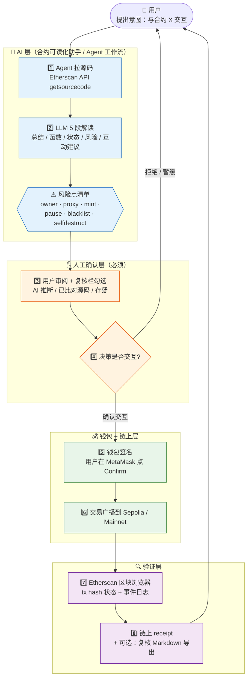

# AI × Web3 Minimal Workflow

> Week 1 综合任务：Draw a Minimal AI × Web3 Workflow（taskId `cmp3jyrc507sin301kjhy1mwf`）。
> 描述一个**有人工确认边界**的最小 Agent + Wallet + Contract 工作流。

## 场景

用户想跟一个**陌生的智能合约**交互（领空投 / swap / 参与新协议）。合约不熟、风险不明、操作不可逆——AI × Web3 最典型的交叉场景。

## 流程图

## 6 点关键标注（WCB 任务①要求）

| # | 问题 | 答案 |
|---|---|---|
| 1 | **谁发起任务** | 👤 用户（学员）本人。 |
| 2 | **谁执行** | 第 1-2 步由 AI Agent 自动执行（拉源码 + LLM 解读）；第 5-6 步由钱包 + 链上节点执行；第 7-8 步由公共区块浏览器 / 数据层完成。 |
| 3 | **哪一步需要签名 / 付款 / 授权** | 第 5 步「钱包签名」。Agent **从不持有私钥**，签名永远在用户的钱包里发生。 |
| 4 | **哪一步必须人工确认** | 第 3-4 步（审阅 LLM 解读 + 决策是否交互）和 第 5 步（钱包 UI 二次确认）。两道确认都不能跳过——Agent 可以建议，但不能代签。 |
| 5 | **结果如何被验证** | 第 7-8 步：通过 Etherscan tx hash + 链上 receipt 验证。本工作流的「合约可读化助手」还内置「复核 Markdown 导出」，让用户保留**AI 解读中哪些段落经过人工核对**的可追溯证据。 |
| 6 | **风险点** | a) LLM 训练数据陈旧——Etherscan V1 已弃用却仍被引用，必须真机验证；b) 代理合约真实逻辑在 implementation 地址，单看 proxy 源码会误判；c) 浏览器直调 LLM 受 CORS / 地区限制，错误信息容易把「Key 错」误判成「网络问题」；d) 用户疲劳点确认——钱包签名变成肌肉反射，6 类风险检查被跳过去；e) AI Agent 私自拓宽权限——必须用系统 Keychain 等机制保护 Key，不能存 `.env`。 |

## 已落地的实例

这张图不是空想——本工作流的 **第 1-3 步** 已经在 [week1-contract-reader](https://github.com/huahuahua1223/week1-contract-reader) Demo 中实装：

- **拉源码（步骤 1）**：Etherscan V2 endpoint，Mainnet / Sepolia 双网
- **LLM 5 段解读（步骤 2）**：Anthropic / OpenAI / OpenAI 兼容（智增增 / 美团 LongCat ¥0 免费）三类 provider 任选
- **风险点清单（步骤 2.5）**：写进 system prompt 强制 LLM 逐项核对（owner / proxy / mint / pause / blacklist / selfdestruct）
- **人工复核栏（步骤 3）**：每段勾选 AI 推断 / 已比对源码 / 存疑，导出 Markdown 留存证据

**第 5-8 步** 的钱包签名 → Sepolia 交易 → Etherscan 验证 在 Week 1 Web3 任务中独立完成：

- ETH 转账：[sepolia.etherscan.io/tx/0x2e13...0a82](https://sepolia.etherscan.io/tx/0x2e13e37794e76385c7fc8078bc2afc7ec166ee57abb8fb2382e68549e0ec0a82)
- 合约部署 + 写入：Week1Note `0x1d7d...d4C0` → [Etherscan 验证源码](https://sepolia.etherscan.io/address/0x1d7d2E0bea1dE798Ad84D0E7fD57a33F8E6ed4C0#code)

**下一步**：把两边串起来，让 Demo 的 LLM 解读输出**直接驱动钱包发起 Sepolia 交易**，形成端到端闭环。这正好对应 [Bridge > Agent Wallet](https://aiweb3school.com/zh/handbook/bridge/agent-wallet/) Handbook 章节里讨论的「Agent 权限、额度限制和撤销机制」。
