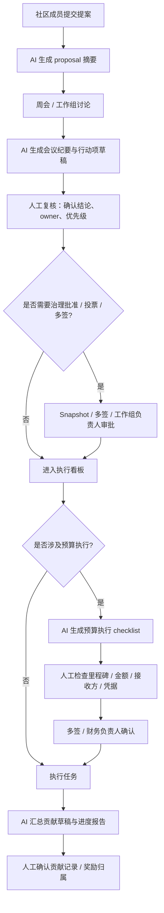

# DAO 治理协作流程草图：Meeting-to-Action Workflow

> 用途：Week 2 Module G `Governance / Coordination｜治理协作流程草图`
> 选择的场景：一个小型 DAO / 社区工作组的**提案讨论会 -> 行动项落地 -> 预算执行前检查**流程
> 目标：明确 AI 能辅助的步骤，和必须由人或治理流程确认的步骤

这份草图不讨论链上协议细节，而聚焦一个更现实的治理问题：

> 社区开会讨论一个提案之后，如何把“讨论”变成可执行的行动项，同时避免 AI 把“总结”误变成“决策”。

因此我选择做的是：

**meeting-to-action workflow + budget execution checklist**

它比单纯 proposal summarizer 更完整，因为治理真正容易出错的地方不在“总结得够不够快”，而在：

- AI 总结是否偷换结论
- 行动项是否被错误指派
- 预算动作是否被误当作已经批准
- 贡献记录是否被误写成已确认事实

---

## 1. 选择的 DAO / 社区流程

我选的是一个典型的小型 DAO 工作组流程：

1. 社区成员提交一个工作提案
2. 核心成员在周会上讨论
3. 会后形成行动项、负责人、时间表
4. 如果涉及预算，再进入单独的预算执行检查
5. 最终由多签 / Snapshot / 人工审批 / 工作组负责人完成确认

这个流程之所以适合作为 Module G，是因为它正好处在 AI 很擅长、但又最容易越界的地带：

- AI 很擅长总结会议、提取行动项、整理讨论分歧
- 但 AI 不应该替代治理确认、预算批准和贡献归属确认

---

## 2. 这条流程里 AI 可以做什么

### 2.1 Proposal summarizer

AI 可以：

- 把一份长提案压缩成 1 页摘要
- 提取目标、背景、预算申请、时间线、潜在风险
- 标记讨论中的支持点、反对点、待澄清点

AI 不能：

- 代替社区成员投票
- 把“多数人看起来支持”写成“已通过”
- 把“提案里说会交付”写成“已经承诺并确认”

### 2.2 Meeting-to-action workflow

AI 可以：

- 把会议录音 / 笔记整理成结构化会议纪要
- 提取明确行动项
- 给每个行动项建议 owner / due date / blocker
- 区分“已决定”“待确认”“纯讨论”

AI 不能：

- 擅自指定最终负责人
- 把模糊讨论写成刚性决策
- 把开放问题写成默认结论

### 2.3 Contribution tracker

AI 可以：

- 聚合 PR、会议、评论、文档、设计稿等证据
- 生成贡献草稿清单
- 帮工作组整理“谁做了什么”的初稿

AI 不能：

- 最终裁定贡献归属
- 决定奖励金额
- 判断争议贡献的价值归属

### 2.4 Budget execution checklist

AI 可以：

- 生成预算执行前 checklist
- 核对“这笔付款是否存在对应提案 / 已批准预算 / 已完成里程碑”
- 标记缺失材料

AI 不能：

- 直接批准拨款
- 把 checklist 通过解释成预算已经被治理流程批准
- 替多签持有人做最终签名动作

---

## 3. 整体流程图



---

## 4. 每一步谁来做

| 步骤 | AI 可辅助 | 必须人工 / 治理确认 |
|---|---|---|
| 提案摘要 | ✅ 可以总结 | 提案原意是否被正确保留，需人工确认 |
| 会议纪要 | ✅ 可以整理 | 结论、行动项、owner 需人工确认 |
| 行动项分派 | ✅ 可以建议 | 最终负责人和时间表必须由人确认 |
| 治理批准判断 | ✅ 可以提醒是否需要治理流程 | 是否真正进入 Snapshot / 多签 / 审批流程必须由人决定 |
| 预算执行检查 | ✅ 可以跑 checklist | 金额、接收方、付款依据必须人工确认 |
| 多签 / 付款 | ❌ 不能替代 | 必须由多签持有人或财务负责人操作 |
| 贡献记录草稿 | ✅ 可以聚合证据 | 最终贡献归属与奖励金额必须人工确认 |

---

## 5. 哪些结论只是 AI 总结

下面这些内容，只能被视为 **AI summary / draft**，不能被视为治理事实：

- “本次会议主要支持这个方向”
- “A 看起来更适合做 owner”
- “这笔预算大概率符合上次讨论”
- “这个成员贡献看起来比较大”
- “这份提案的风险可接受”

原因很简单：

> 这些话本质上都是对人类讨论的压缩，不是治理结果本身。

它们可以帮助社区更快推进，但不能自动升级成：

- 已通过
- 已批准
- 已分配
- 已拨款
- 已确认贡献

---

## 6. 哪些动作必须人工确认或治理流程通过

### 6.1 人工确认

- 会议纪要中的最终结论
- 行动项 owner
- 时间节点与优先级
- “待确认”事项是否真的关闭
- 预算执行前的凭据完整性

### 6.2 治理流程通过

- 提案是否正式通过
- 是否进入预算执行
- 实际拨款
- 多签签名
- 争议贡献的奖励归属

### 6.3 不能省略的治理动作

- Snapshot / 投票
- 多签签名
- 工作组负责人审批
- 财务角色的预算复核

这些动作可以被 AI **提醒**，但不能被 AI **代行**。

---

## 7. Meeting-to-Action Workflow 草图

### 7.1 输入

- 提案文档
- 会议录音 / 笔记
- 讨论串 / 评论区
- 上次会议未完成行动项

### 7.2 AI 输出草稿

AI 生成一个结构化草稿：

| 字段 | 说明 |
|---|---|
| `proposal_summary` | 这次讨论的 5 句摘要 |
| `agreed_points` | 明确已有共识的点 |
| `open_questions` | 仍未确认的问题 |
| `suggested_actions` | 建议行动项列表 |
| `suggested_owners` | 可能的负责人候选 |
| `suggested_deadlines` | 建议时间节点 |
| `governance_required` | 哪些项需要投票 / 多签 / 审批 |

### 7.3 人工复核后落地

真正进入执行看板前，人工要把上面的草稿转成：

- 已确认行动项
- 已确认 owner
- 已确认截止时间
- 已确认哪些只是备注、哪些是真正待办

### 7.4 一个最小输出示例

```markdown
## 本次会议结论（AI 草稿，待人工确认）

- 大家倾向先做 MVP，而不是一次性做完整治理模块
- 预算申请可以拆成两阶段
- 需要补一份风险说明

## 建议行动项（AI 草稿，待人工确认）

1. A 起草 MVP scope 文档（建议截止：本周五）
2. B 补预算分阶段说明（建议截止：本周六）
3. C 输出风险说明草稿（建议截止：下周一）

## 需要治理流程确认

- 是否批准预算阶段 1
- 是否接受里程碑定义
- 是否进入多签付款流程
```

---

## 8. Budget Execution Checklist 草图

即使 proposal 和会议都过了，预算执行仍然要单独卡一层。

### 8.1 AI 可生成的 checklist

| 检查项 | AI 可辅助 | 最终确认方 |
|---|---|---|
| 是否存在对应提案 | ✅ 查文档 / 查投票链接 | 人工 |
| 是否已经通过 | ✅ 汇总状态 | 治理流程 / 人工 |
| 付款对象是否匹配 | ✅ 对照地址簿 / 记录 | 财务 / 多签持有人 |
| 金额是否在已批准预算内 | ✅ 计算与比对 | 财务 / 多签持有人 |
| 是否已完成对应里程碑 | ✅ 汇总证据 | 工作组负责人 / 人工 |
| 是否已有付款记录 | ✅ 聚合历史 | 财务 / 多签持有人 |

### 8.2 为什么这一层不能自动过

因为“提案通过”不等于“这笔钱现在就该打”。

中间还隔着：

- 里程碑是否完成
- 接收地址是否正确
- 付款金额是否匹配
- 是否已有重复付款
- 是否需要第二签 / 第三签

---

## 9. 贡献记录草图

AI 最适合做的是：

- 聚合证据
- 生成贡献候选清单
- 提示哪些贡献缺佐证

AI 不适合做的是：

- 最终决定谁该拿多少奖励
- 处理争议归属
- 把“参与讨论”自动算成“完成交付”

### 9.1 一个最小贡献记录表

| 成员 | AI 汇总到的证据 | AI 初步分类 | 必须人工确认的点 |
|---|---|---|---|
| A | proposal 草稿、PR、会议主持 | proposal / execution | 贡献权重是否合理 |
| B | 预算说明文档、review comment | ops / finance support | 是否算核心交付 |
| C | 风险说明、文档修订 | research / docs | 是否满足奖励标准 |

---

## 10. 这条治理协作流程里的风险

### 10.1 AI 越界风险

- 把“总结”写成“结论”
- 把“建议 owner”写成“已分配 owner”
- 把“看起来可行”写成“已批准”

### 10.2 协调失真风险

- 会议里模糊表述被 AI 过度确定化
- 行动项在转写时丢失约束条件
- 开放问题被错误关单

### 10.3 预算执行风险

- 金额匹配错
- 接收方错
- 重复付款
- 里程碑未完成却被错误放行

### 10.4 贡献记录风险

- AI 把可见证据多的人高估
- 把幕后协调、review、组织工作低估
- 奖励分配被“可量化证据偏好”带偏

---

## 11. 最终边界结论

这份 Module G 的核心结论是：

> **AI 在治理协作里最适合做“压缩信息、整理结构、生成草稿、聚合证据”，但不适合代替治理确认本身。**

也就是说：

- AI 可以更快地把 proposal、meeting、action、budget、contribution 这五段流程串起来
- 但它不能把“可读性提升”偷换成“治理已完成”

真正必须由人或治理流程保留的动作仍然是：

- 通过与否
- owner 最终确认
- 预算批准
- 多签执行
- 贡献归属与奖励分配

如果不把这条边界写清楚，社区很容易从“AI 提高治理效率”滑向“AI 模糊治理责任”。

这就是我对 Week 2 Module G 的最终回答。
