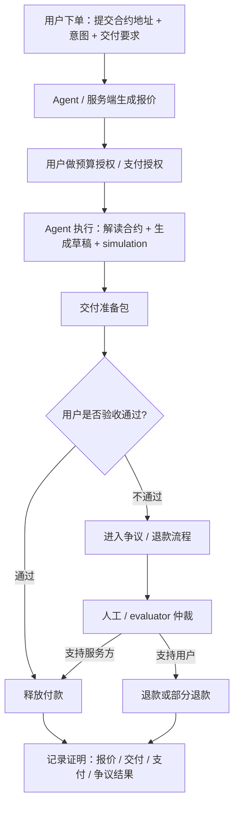

# 最小支付与商业流程拆解

> 用途：Week 2 Module B `Payment / Commerce｜最小支付与商业流程拆解`
> 选择场景：**Contract Interaction Prep Agent 帮用户完成陌生合约交互前的准备工作，并按次收款**
> 目标：拆出一个完整的 `agent 帮人完成任务并收款` 流程，回答谁下单、谁执行、谁验收、谁付款、谁仲裁

我没有选一个和本周主线无关的新场景，而是直接沿用已经成形的对象：

> **Contract Interaction Prep Agent**  
> 一个不代签、不自动广播，但能帮用户完成“理解合约 -> 准备交易 -> 风险检查 -> 进入钱包确认 -> 交易后验证”的前置准备 agent。

如果这个 agent 未来变成一个真正可收费的服务，那么最自然的商业问题就是：

> **用户愿不愿意为“高风险链上交互前的准备工作”付费？如果愿意，这笔钱在什么时点付、谁来验收、怎么退款、怎么仲裁？**

---

## 1. 场景定义

### 1.1 交易对象不是“链上结果”，而是“前置准备服务”

这条 payment / commerce flow 的关键，不是让 agent 替用户直接做链上交易，而是：

**让用户为一个可交付的前置准备结果付费。**

这份交付结果包括：

- 合约解读摘要
- 风险清单
- 交易草稿 / calldata 草稿
- simulation 结论
- 预算与权限边界提示
- 进入钱包确认前的最后检查清单

也就是说，用户买的不是“盈利结果”，而是：

> **一个更安全、更清晰、更省时间的链上交互前准备包。**

### 1.2 为什么这个场景适合 Module B

因为它天然包含支付与商业闭环中的所有角色：

- 有人下单
- 有人执行
- 有人验收
- 有人付款
- 有争议时有人仲裁
- 整个过程能留下验证材料

---

## 2. 角色拆解

| 角色 | 在这个场景里是谁 | 职责 |
|---|---|---|
| 下单方 | 用户 / 开发者 / 研究者 | 提交需要分析的合约与意图 |
| 执行方 | Contract Interaction Prep Agent 服务 | 读取合约、生成报告、准备交易草稿、输出风险检查 |
| 验收方 | 用户本人 | 检查交付结果是否满足约定 |
| 付款方 | 用户的钱包 / 支付账户 | 为交付结果付款 |
| 仲裁方 | 人工支持 / 平台争议流程 / 预先约定的 evaluator | 在交付争议时做裁定 |
| 记录方 | 服务端日志 + 交付哈希 + 支付记录 | 提供事后证明材料 |

### 2.1 这里的关键边界

执行方是 agent，但：

- **验收不是 agent 自动决定**
- **付款释放不是 agent 自动批准**
- **争议裁定不是 agent 自动拍板**

这保证了 payment / commerce flow 仍然有清晰责任边界。

---

## 3. 最小 payment / commerce flow



---

## 4. 每一步具体做什么

### 4.1 下单（Order）

用户提交：

- 合约地址
- 链
- 想做的动作（如读懂 / 准备转账 / 准备 approve / 准备交互）
- 对交付物的期望
- 时间要求

一个最小下单对象可以是：

```json
{
  "request_id": "prep-2026-05-29-001",
  "chain": "sepolia",
  "contract_address": "0xRouter...",
  "intent": "prepare one exact approve draft",
  "deliverables": [
    "contract_summary",
    "risk_checklist",
    "calldata_draft",
    "simulation_result"
  ],
  "deadline": "2026-05-29T20:00:00+08:00"
}
```

### 4.2 报价（Quote）

agent 或服务端返回报价时，不能只说一个数字，而应写清：

| 字段 | 说明 |
|---|---|
| `price` | 这次服务多少钱 |
| `currency` | USDC / fiat / 其他 |
| `scope` | 这次包含哪些交付物 |
| `sla` | 预计交付时间 |
| `acceptance_window` | 用户有多久时间决定是否验收通过 |
| `refund_policy` | 什么情况下可退 / 部分退款 |
| `dispute_policy` | 谁有权仲裁，证据是什么 |

一个最小报价例子：

```json
{
  "quote_id": "quote-2026-05-29-001",
  "price": "5.00",
  "currency": "USDC",
  "scope": [
    "contract_summary",
    "risk_checklist",
    "single_tx_draft",
    "simulation"
  ],
  "sla": "30 minutes",
  "acceptance_window": "24 hours",
  "refund_policy": "full refund if deliverables missing; partial refund if materially incomplete",
  "dispute_policy": "human review with delivery logs and output hash"
}
```

### 4.3 预算授权（Budget Authorization）

用户需要批准的不应是“以后都可以收我钱”，而是本次任务级别的预算。

预算授权至少应包括：

- 本次价格上限
- 支付对象
- 有效时间
- 是否单次扣费
- 争议期内是否暂缓释放

一个最小预算授权对象：

```json
{
  "quote_id": "quote-2026-05-29-001",
  "payer": "0xUserWallet...",
  "payee": "0xServiceWallet...",
  "max_amount": "5.00 USDC",
  "expires_at": "2026-05-29T20:00:00+08:00",
  "release_rule": "release_after_acceptance_or_dispute_resolution",
  "max_uses": 1
}
```

### 4.4 执行（Execution）

agent 开始做真正的工作：

- 拉源码 / ABI
- 识别 proxy / owner / pause / mint / spender 风险
- 生成交易草稿
- 做 simulation
- 输出结构化报告

这里仍然要强调：

> 它交付的是“准备包”，不是“链上执行结果”。

### 4.5 交付（Delivery）

交付物最少包含：

- 一页结构化摘要
- 风险点清单
- 交易草稿
- simulation 结果
- 适用范围与未验证项

交付时应生成：

- 交付哈希
- 时间戳
- 使用了哪些工具
- 基于哪个报价 / 订单

### 4.6 验收（Acceptance）

用户要验收的不是“这笔链上交易后来赚没赚钱”，而是：

- 是否按报价交齐了内容
- 是否覆盖了约定 scope
- 草稿是否可读、可复核
- simulation 是否存在明显缺失
- 关键对象 / selector / 风险点是否被错误遗漏

验收结果应有三档：

- `accept`
- `reject`
- `dispute`

### 4.7 付款 / 退款 / 争议（Payment / Refund / Dispute）

#### 付款

若用户验收通过，付款释放给服务方。

#### 退款

若交付物缺失、严重不完整、和报价 scope 明显不符，可全额或部分退款。

#### 争议

争议的判断依据不能是“用户主观上不满意”，而应看：

- scope 是否交齐
- 报告是否有明显错误
- simulation / 风险检查是否漏掉约定项
- 交付是否超时

### 4.8 记录证明（Proof / Evidence）

至少应留下：

- `request_id`
- `quote_id`
- 预算授权对象
- 交付哈希
- 交付时间
- 验收结果
- 支付结果
- 如有争议，仲裁结果

---

## 5. 一张更细的角色表

| 阶段 | 下单方 | 执行方 | 验收方 | 付款方 | 仲裁方 |
|---|---|---|---|---|---|
| 下单 | 用户 | - | - | - | - |
| 报价 | - | Agent / 服务端 | - | - | - |
| 预算授权 | 用户 | - | - | 用户 | - |
| 执行 | - | Agent | - | - | - |
| 交付 | - | Agent | 用户 | - | - |
| 验收 | - | - | 用户 | - | - |
| 争议 | 用户 / 服务方 | - | - | - | 人工 / evaluator |
| 结算 | - | - | - | 用户资金 -> 服务方 | 争议时由仲裁结果决定 |

---

## 6. 为什么这个 flow 不是纯 AI 问题

如果没有支付、预算、结算、争议、证明这几层，这个场景只剩下：

- 让模型生成一段分析

那它还不是商业流程，只是内容生成。

真正让它成为 `payment / commerce flow` 的，是这些 Web3 / payment 机制：

- 钱包或支付账户
- 预算授权
- 支付释放
- 退款
- 争议仲裁
- 记录证明

---

## 7. 为什么这个 flow 不是纯 Web3 问题

如果没有 AI，这个流程也成立不了当前这个服务形态，因为：

- 报告需要被压缩、结构化、解释
- 风险点需要被整理
- 交易草稿需要从自然语言意图出发组织出来
- 交付物的核心价值就是“AI 帮你节省理解与准备时间”

也就是说：

> Web3 在这里解决的是支付与责任边界；AI 在这里解决的是交付内容本身的生产效率。

---

## 8. 低风险路径与高风险路径

### 8.1 低风险路径

适合直接走报价 -> 预算授权 -> 交付 -> 验收 -> 付款：

- 只读分析
- 单次小额固定价
- scope 明确
- 争议成本低
- 没有真实资产广播

### 8.2 高风险路径

需要更强保护：

- 报价过高
- scope 模糊
- 交付结果会直接影响高金额链上动作
- 涉及多次修改 / 多次交付
- 涉及多方协作与争议

高风险路径应该增加：

- 更强验收窗口
- 更细交付证明
- 暂缓释放机制
- evaluator / 人工仲裁

---

## 9. 可选加分：比较 x402 与 MPP

这一版我改成更教科书式的写法，直接比较题面里出现的两个协议：

- `x402`
- `MPP`（Machine Payments Protocol）

### 9.1 x402 更适合什么

根据官方文档，x402 是一个建立在 **HTTP `402 Payment Required`** 上的开放支付标准，强调：

- 受保护的 API / 内容可以在 HTTP 层直接返回付款要求
- 客户端可以在没有账号、session、API key 的前提下，对资源请求进行程序化支付
- 服务端在收到付款后，再返回真正资源

它最适合解决的，是这条链路：

**请求资源 -> 返回付款要求 -> 程序化付款 -> 验证与结算 -> 返回结果**

也就是：

> 更适合处理 **请求前支付 / API-native paywall / 按次访问收费**

### 9.2 MPP 更适合什么

根据 Stripe 的 machine payments 文档，MPP 更强调：

- 让 agent 为资源、服务或 API 程序化支付
- 卖方把机器支付接入现有支付和结算体系
- 配套退款、收单、报表、运营后台

它更适合解决的，是这条链路：

**卖方收款 -> 退款处理 -> 报表与结算 -> 平台化运营**

也就是：

> 更适合处理 **平台化卖方收单、退款、运营结算**

### 9.3 两者差异

| 维度 | x402 | MPP |
|---|---|---|
| 主要关注点 | HTTP 原生付款请求 | 机器支付收单与平台化支付处理 |
| 更像解决哪一段 | 请求前支付 / paywall | 收单 / 退款 / 结算 / 报表 |
| 接入方式 | 更开放协议化 | 更平台 / 支付基础设施化 |
| 当前场景更贴近哪边 | 如果把 agent 服务做成开放 API，更贴近 x402 | 如果把服务做成可运营的卖方产品，更贴近 MPP |

### 9.4 顺手补一句：ERC-8004 / ERC-8183 不在同一层

虽然这次我选的是 `x402` 和 `MPP`，但也顺手说明一下另外两个：

- `ERC-8004`
- `ERC-8183`

它们更偏：

- identity / capability / job / evaluator / escrow / 验证与协作关系

而不是像 `x402` / `MPP` 那样优先解决“HTTP/API 请求怎么付钱、怎么收款、怎么结算”的问题。

所以如果用一句话区分：

- `x402 / MPP` 更像 **支付与收单协议层**
- `ERC-8004 / ERC-8183` 更像 **agent 协作、任务、验证、仲裁关系层**

### 9.5 我的判断

如果 `Contract Interaction Prep Agent` 以后做成：

- **开放 API / 按次付费服务**：更贴近 `x402`
- **平台化收费产品 / 退款 / 报表 / 运营后台**：更贴近 `MPP`
- **带有 evaluator / job / escrow 的 agent 市场**：才更接近 `ERC-8004 / ERC-8183`

---

## 10. 最终结论

这份 Module B 的核心结论是：

> 一个 agent 帮人完成任务并收款的最小商业闭环，不是“模型回答完就收钱”，而是要把报价、预算授权、执行、交付、验收、付款、退款、争议和证明全部串起来。

在我这条主线里，最合适的商业场景不是让 agent 为“链上结果”背书，而是让用户为：

**一个可复核的、可交付的、可验收的“链上交互前置准备包”付费。**

这样做的好处是：

- 服务边界更清楚
- 验收标准更明确
- 争议更容易裁定
- agent 的责任不会被夸大到“对交易盈亏负责”

所以，我对 Module B 的最终回答是：

- 下单方：用户
- 执行方：Contract Interaction Prep Agent
- 验收方：用户
- 付款方：用户的钱包 / 支付账户
- 仲裁方：人工 / evaluator / 平台争议流程

这才构成一个最小但完整的 payment / commerce flow。
