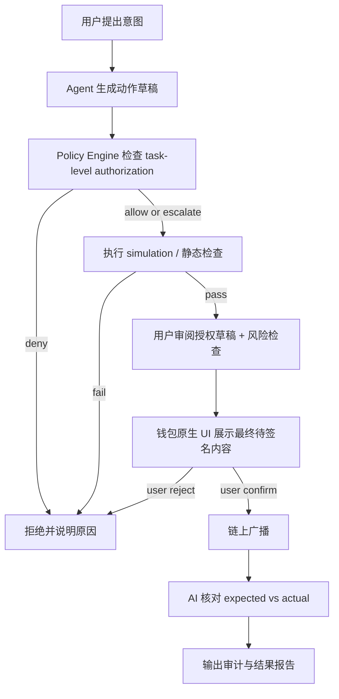

# 受限 Web3 助手设计（正式版 Permission Strategy）

> 初版来源：Week 1 综合进阶任务 `Design a Restricted Web3 Assistant or Workflow`
> 当前版本用途：Week 2 Module D `Wallet / Permission｜Permission Strategy for Agent-Initiated On-Chain Actions`
> 目标：把 Week 1 的“不要越权”草稿，升级成一份可提交的**任务级授权策略（task-level permission strategy）**

本文基于 [week1-contract-reader](https://github.com/huahuahua1223/week1-contract-reader) 这个已上线的「只读」AI 助手，继续往前推进一层：

- Week 1 解决的是：**帮用户读懂陌生合约**
- Week 2 Module D 要解决的是：**如果 AI 助手进一步帮用户准备链上动作，它的权限边界应该如何被正式定义**

---

## 1. 设计目标

这个助手服务的不是“把交易自动做掉”，而是下面这类真实场景：

> 用户已经知道自己想做什么，但不想自己手写 calldata、查 ABI、算 gas、做静态风险检查；他希望 Agent 帮忙把这些前置工作做完，最后由自己在钱包原生 UI 里确认是否签名。

因此，这个助手的定位不是 autonomous trading bot，而是：

**一个严格受限的、面向链上动作前置准备的 Agent 工作流。**

它可以帮助用户完成：

- 理解目标合约与函数
- 把自然语言意图转成结构化动作
- 生成 calldata 预览
- 做 simulation / 静态检查 / 预算检查
- 在交易后核对 expected vs actual

它**不能**替用户完成：

- 持有私钥
- 绕过钱包原生确认
- 自动广播真实交易
- 静默扩大权限范围

---

## 2. 绝对红线

这份 permission strategy 先定义不能做什么，再定义能做什么。

### 2.1 永不代签

Agent 永远不持有用户私钥、助记词、seed phrase，也不直接控制 signer。

### 2.2 永不自动广播

即使 simulation 成功、预算也在范围内，Agent 仍然不能自己广播真实交易。广播动作只能由用户在钱包原生界面显式确认。

### 2.3 永不静默扩权

用户给的是某个任务、某个对象、某个额度、某个时间窗内的授权，不是“以后都可以”。Agent 不得把一次授权解释成长期权限。

### 2.4 simulation 不是权限

simulation 只能回答“这笔交易按当前状态是否大概率可执行”，不能回答“这笔交易是否值得做、是否已经获准做”。  
**simulation pass 不是授权；simulation fail 只是 gate。**

### 2.5 后台 Agent 不能直连执行路径

像 Hermes 这类长期运行 Agent 可以负责：

- 监控
- 提醒
- 生成草稿
- 组织上下文

但不能直接连到热钱包执行路径。  
**后台常驻进程只允许接近 read / draft / alert，不允许接近 sign / broadcast。**

---

## 3. 角色与边界

| 角色 | 可以做什么 | 不能做什么 |
|---|---|---|
| 用户 | 发起任务、批准授权草稿、在钱包中签名、决定是否广播 | 不能把“看过 Agent 结果”当成“已经授权” |
| Agent | 解释合约、整理意图、生成 calldata 草稿、做风险检查、发起 simulation、生成验证报告 | 不能持有私钥、不能签名、不能广播、不能扩大授权 |
| Policy Engine | 校验当前任务是否在授权范围内，决定 allow / deny / escalate | 不能替用户创建生效授权 |
| 钱包原生 UI | 展示目标地址、金额、selector、gas 等最终待签名信息 | 不能替代前面的策略检查 |
| 链上与浏览器 | 提供公开状态、交易回执、事件日志和最终可验证结果 | 不能自动证明用户主观意图正确 |

这里最关键的一点是：

> **Agent 只能起草 authorization draft，真正生效的 authorization 必须由用户批准。**

---

## 4. 任务级授权对象（Task-Level Authorization Object）

本设计不使用“这个助手整体可信”这种粗粒度说法，而使用**任务级授权对象**来定义一次授权。

### 4.1 最小字段

| 字段 | 含义 |
|---|---|
| `task_id` | 本次任务唯一 ID |
| `chain_id` | 允许执行的链 |
| `action_type` | 允许动作类型，如 native transfer / ERC20 transfer / exact approve / contract call |
| `allowed_targets` | 允许交互的目标地址或 spender 白名单 |
| `allowed_selectors` | 允许的方法 selector 白名单 |
| `argument_constraints` | 参数约束，如 recipient 必须在白名单、amount 不得超过上限 |
| `token_budget` | 单笔额度、总额度、gas cap |
| `validity_window` | 生效时间与失效时间 |
| `max_uses` | 最多可用次数，默认 1 |
| `simulation_required` | 是否必须先模拟 |
| `postconditions` | 期望状态变化，如余额变化、事件类型 |
| `failure_policy` | 失败后是 deny、retry 还是 escalate |
| `audit_level` | 记录哪些日志字段、哪些字段必须脱敏 |

### 4.2 示例

```json
{
  "task_id": "swap-sepolia-eth-to-usdc-2026-05-29-001",
  "chain_id": 11155111,
  "action_type": "contract_call",
  "allowed_targets": ["0xRouter..."],
  "allowed_selectors": ["0x7ff36ab5"],
  "argument_constraints": {
    "recipient": "0xMyWallet...",
    "max_input_eth": "0.10",
    "min_output_token": "100"
  },
  "token_budget": {
    "per_tx_eth": "0.10",
    "total_eth": "0.10",
    "gas_cap_eth": "0.005"
  },
  "validity_window": {
    "not_before": "2026-05-29T19:00:00+08:00",
    "expires_at": "2026-05-29T19:15:00+08:00"
  },
  "max_uses": 1,
  "simulation_required": true,
  "postconditions": {
    "expected_recipient": "0xMyWallet...",
    "expected_event_types": ["Swap"],
    "must_not_call_unlisted_target": true
  },
  "failure_policy": "freeze_and_escalate",
  "audit_level": "full_redacted"
}
```

### 4.3 设计原则

1. **默认一次一授权**：不做长期 blanket approval
2. **默认单链**：每次授权只对应 1 个 `chain_id`
3. **默认单用途**：`max_uses = 1`
4. **默认精确 selector**：允许的是具体方法，而不是“这个合约你都可以调”
5. **默认精确额度**：预算必须细到 per-tx 与 total

---

## 5. 权限层级

权限不应该只有“允许 / 禁止”两档，而要分层。

| 层级 | 名称 | 能做什么 | 典型场景 |
|---|---|---|---|
| P0 | Observe Only | 只读链上状态、拉源码、拉 ABI、读回执 | contract-reader 当前已落地能力 |
| P1 | Prepare Only | 生成 calldata、估 gas、做 simulation、给出风险清单 | 用户准备与陌生合约交互 |
| P2 | Present to Wallet | 把**已经过策略检查**的精确交易草稿交给钱包 UI 展示 | 小额转账、白名单合约调用 |
| P3 | Escalate Required | 允许进入人工复核，但不能继续自动推进 | 涉及高金额、敏感权限、复杂多调用 |
| P4 | Hard Deny | 直接拒绝，不进入执行流程 | 无限 approve、未知 spender、管理员函数、权限扩大 |

### 5.1 当前设计允许的动作

- 原生代币小额转账
- ERC20 `transfer`
- ERC20 **精确额度** `approve`
- 目标合约 / selector 都在白名单里的单次 `contract_call`

### 5.2 当前设计默认拒绝的动作

- `approve(spender, MAX_UINT256)` 无限授权
- 未在白名单中的 spender / recipient
- proxy 但 implementation 无法确认的管理型调用
- `delegatecall`、管理员函数、upgrade 函数、ownership 转移
- 多目标批量 `multicall` 且 payload 不能被完整解释
- 超出时间窗 / 超出额度 / 超出次数限制的任何动作

### 5.3 人工确认阈值

这个策略不是“所有交易都同一种确认方式”，而是按风险分层。

| 场景 | 阈值 | 处理方式 |
|---|---|---|
| 白名单地址的小额原生转账 | `<= 0.1 ETH` 且仅 1 次使用 | 允许进入钱包确认流程 |
| 白名单 ERC20 转账 | 额度 `<=` 本次授权对象声明值 | 允许进入钱包确认流程 |
| ERC20 `approve` | 只允许**精确额度 approve** | 新 spender 或接近预算上限时升级人工复核 |
| 合约调用 | target + selector + 参数范围都在白名单 | 允许进入钱包确认流程 |
| 任意跨链、多调用、未知 proxy 管理函数 | 任意金额 | 不进入普通流程，直接升级或拒绝 |
| 任意超预算 / 超时 / 超次数 | 任意金额 | 直接拒绝 |

我在这里故意把阈值写成**小额、单次、白名单、精确额度**四个关键词，是因为这个助手的目标不是追求最大自动化，而是先把越权面压到最小。

---

## 6. 执行流程



### 6.1 各步分工

| 步骤 | 自动 / 人工 | 说明 |
|---|---|---|
| 1. 用户提出意图 | 人工 | 例如“给白名单地址转 0.1 ETH” |
| 2. Agent 生成动作草稿 | 自动 | 解析意图、准备参数、标注目标对象 |
| 3. Policy Engine 校验授权 | 自动 | 看是否在 task-level authorization 范围内 |
| 4. simulation / 静态检查 | 自动 | 这里只是 gate，不是 permission |
| 5. 用户审阅授权草稿 | 人工 | 看授权范围、额度、对象、失效时间 |
| 6. 钱包原生 UI 确认 | 人工 | 签名与广播前的最终核对 |
| 7. 结果验证 | 自动 + 人工 | Agent 先对账，异常再交人工判断 |

---

## 7. 人工确认点

### 7.1 授权草稿确认

用户必须先确认本次授权对象，而不是直接看交易结果。

最低限度要看清：

- 目标链
- 目标地址 / spender
- 允许的方法
- 金额上限
- 失效时间
- 是否单次使用

### 7.2 钱包原生 UI 二次确认

最终确认必须发生在钱包原生界面，而不是 Agent 自己渲染的 UI。

用户至少核对：

- `to`
- `value`
- function selector 或人话方法名
- spender / recipient
- gas 级别是否异常

### 7.3 特殊风险强化确认

以下情况必须升级到更强确认，不得走普通流程：

- `approve` 涉及新 spender
- 任意跨链动作
- 任意与 proxy 管理接口相关的动作
- 任意接近预算上限的动作
- 任意 simulation 与期望结果不完全一致的动作

---

## 8. failure policy、撤销与审计

### 8.1 failure policy

默认策略不是“失败了自动重试”，而是：

**freeze and escalate**

也就是：

1. 当前 task-level authorization 立即冻结
2. Agent 停止继续推进
3. 输出失败原因与已知上下文
4. 交回人工判断是否重建一张新的授权对象

### 8.2 撤销机制

授权对象必须支持显式撤销，至少包括：

- 手动撤销
- 超时失效
- 单次使用后自动失效
- 发生异常后自动冻结

### 8.3 审计字段

审计日志最少要记录：

- `task_id`
- 请求时间
- 链与目标对象
- 允许的 selector 与实际 selector
- 预算与实际花费
- simulation 结果摘要
- 用户确认时间
- tx hash
- expected vs actual 对比结果

必须脱敏或禁止写入的内容：

- 私钥 / 助记词
- 完整 API key
- 钱包恢复信息
- 与本次任务无关的完整上下文历史

---

## 9. 风险控制与拒绝条件

### 9.1 高概率风险

1. **Agent 篡改目标对象或参数**
   缓解：所有最终待签内容都必须在钱包原生 UI 再核对一次；授权对象只允许精确 selector 与参数范围

2. **默认值悄悄扩大权限**
   缓解：任何新 spender、新链、新 selector 都视为新授权，而不是旧授权延续

3. **长期后台进程误入执行路径**
   缓解：后台 Agent 只允许 monitor / draft / alert；sign / broadcast 只能由前台短路径完成

4. **simulation 通过被误解为“安全”**
   缓解：文档与 UI 明确写出“simulation 只是 gate，不是 permission，也不是 recommendation”

5. **用户疲劳确认**
   缓解：大额倒计时、关键字段高亮、异常预算提示、每日签名统计

### 9.2 直接拒绝条件

- 无限授权
- 未知 spender
- 未知 selector
- 额度超限
- 时间窗过期
- 使用次数超限
- implementation 无法确认的敏感 proxy 调用
- 任何需要管理员权限的函数
- 任何“先给权限，再让 Agent 自己决定怎么花”的设计

---

## 10. 为什么 ERC-4337、Safe、guard / policy 机制重要

这三个概念重要，不是因为它们是“更高级的钱包名词”，而是因为它们分别给了 Agent wallet 场景里最缺的三类能力：**可编程账户、权限分层、执行前拦截**。

### 10.1 ERC-4337：把账户变成可编程执行入口

ERC-4337 重要，是因为它把“账户”从单纯 EOA 私钥签名，推进到更像智能账户（smart account）的模式。

对本任务的价值：

- 更容易表达 session key、额度限制、时间窗、单次授权这些条件
- 更容易把 paymaster、bundler、policy 检查拼进执行路径
- 让“谁来发起动作、谁来付 gas、谁来限制动作范围”可以被显式设计

它主要解决的风险：

- 单一私钥权限过大
- 一签到底、难以表达细粒度授权
- Agent 想帮忙做事时，执行边界太粗

### 10.2 Safe：把资产控制与权限控制从一开始就分层

Safe 重要，是因为它天然把“账户控制权”做成可组合的多签 / 模块 / policy 空间，而不是默认所有动作都靠一个热钱包直接签掉。

对本任务的价值：

- 可以把真正高价值资产放在更严格的控制层
- 可以把日常 Agent 辅助动作放在更小额度、更细权限的执行层
- 可以通过模块、阈值和审批链把“谁能做什么”拆开

它主要解决的风险：

- 单点 signer 被盗或误签
- 所有资金都暴露在同一套执行路径
- 高风险动作和低风险动作没有隔离

### 10.3 guard / policy：把“执行前拦截”变成正式机制

guard / policy 机制重要，是因为它回答了一个很现实的问题：

> 就算交易是用户点的、甚至 signer 也是合法的，这笔交易本身有没有违反预先定义的边界？

对本任务的价值：

- 可以在签名前检查 target、selector、额度、频率、链、白名单
- 可以把“无限授权”“新 spender”“未知多调用”等情况直接拦下来
- 可以把失败处理从“签完再说”改成“执行前就阻断”

它主要解决的风险：

- 合法 signer 发起了不该执行的动作
- 默认值或 UI 疏忽导致权限静默扩大
- Agent 工作流把错误参数一路传到钱包

### 10.4 三者在这份策略里的对应关系

| 机制 | 在本文里的角色 | 它保护什么 |
|---|---|---|
| ERC-4337 | 可编程账户与细粒度授权的基础能力 | 解决“账户只有粗粒度私钥权限”的问题 |
| Safe | 资产控制层与审批层 | 解决“高价值资产与低价值自动化动作不分层”的问题 |
| guard / policy | 执行前策略闸门 | 解决“交易已生成但仍可能越权”的问题 |

---

## 11. 这份 Permission Strategy 与现有 Demo 的关系

| 能力 | 当前状态 | 说明 |
|---|---|---|
| 合约阅读与风险解释 | ✅ 已上线 | `week1-contract-reader` 已实现 |
| task-level authorization object | ✅ 已设计 | 本文正式定义 |
| 白名单 + 精确额度 + 时间窗策略 | ✅ 已设计 | 本文正式定义 |
| simulation 结果作为 gate | ✅ 已设计 | 明确不是权限本身 |
| 钱包签名 / 广播 | ⬜ 待实现 | 未来接 wagmi / viem / MetaMask |
| post-trade verification | ⬜ 待实现 | 未来做 receipt + event parser |
| 自动撤销 / 冻结 / 审计面板 | ⬜ 待实现 | 未来产品化部分 |

---

## 12. 结论

这份正式版 Permission Strategy 的核心结论是：

> **Agent 可以帮用户把链上动作前置准备做到很深，但不能因为“准备得很深”就自动获得执行权。**

真正的权限设计单位应该是：

- 某个任务
- 某个对象
- 某个额度
- 某个时间窗
- 某个使用次数

而不是“这个 Agent 总体上可信，所以以后都可以”。

如果要把 `contract-reader` 从只读助手推进成交易增强版助手，最重要的不是先接钱包，而是先把这张权限边界图画清楚。  
这也是我对 Week 2 Module D 的最终回答。

---

## 13. 对 Module F 的交接

本文已经顺手收进了三条跟 Module F 相邻的约束：

- 最小上下文原则
- 后台 Agent 与执行路径隔离
- 审计日志脱敏

但它仍然**不是完整 threat model**。  
Module F 下一步要补的是：

- prompt injection
- communication exposure
- default visibility
- third-party tool trust boundary
- reasoning / logs / context 的泄露面
