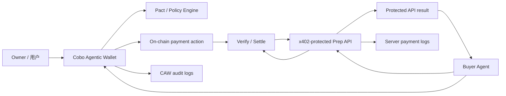
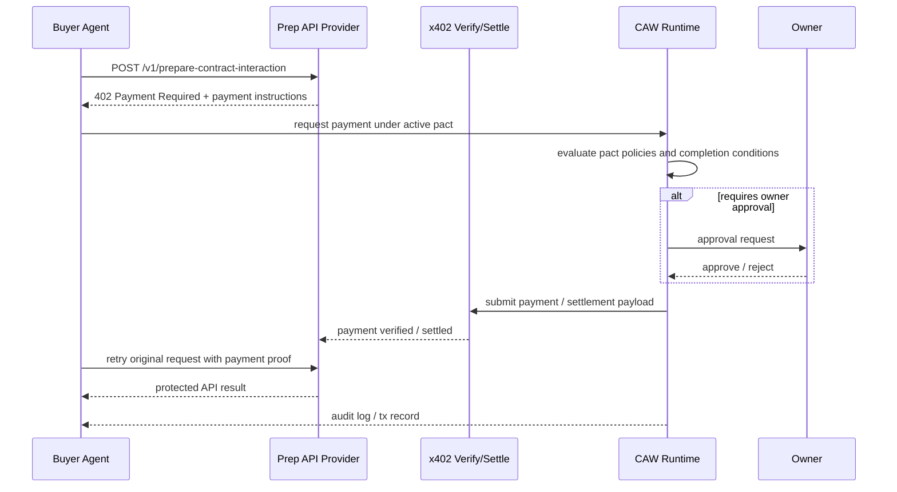

# x402 Paywall + CAW Agent 自主支付闭环（设计型交付）

> 用途：Week 2 Module B 进阶实践 `x402 Paywall + Cobo CAW Agent 自主支付闭环`
> 交付形式：设计型交付（架构图 + 时序图 + 关键接口说明 + 伪代码 + 风险边界）
> 目标：不做真实 demo，也要把“明确授权、预算控制、可审计记录下的自动交易”闭环设计清楚

这个进阶任务不是要证明“agent 会自动花钱”，而是要证明：

> **在明确授权、预算控制和可审计记录存在的前提下，agent 可以程序化地完成一次受保护 API 的支付与取回结果。**

因此，这份设计稿选择的场景是：

> 服务提供方提供一个受 `x402` 保护的“合约交互前置准备 API”；  
> 消费方是一个由 `Cobo Agentic Wallet (CAW)` 提供受限链上能力的 agent；  
> agent 识别 `402 Payment Required`、在 `Pact` 约束下完成支付、保留审计记录、再拿回 API 结果。

---

## 1. 设计目标

这个系统想证明 5 件事：

1. **服务方** 可以把 API 变成受 `x402` 保护的 paywall
2. **消费方 agent** 能识别付款要求并决定是否继续
3. **CAW / Pact** 能把支付动作限制在预算、范围、时间窗之内
4. **payment settlement** 能被验证并留下审计记录
5. **付款成功后** agent 能拿回接口结果，继续自己的工作流

它不试图证明：

- 无限制自动付款
- 高自治托管钱包
- agent 可绕过人工和策略随意花钱

---

## 2. 参与方

| 角色 | 在这个设计里是谁 | 职责 |
|---|---|---|
| 服务提供方 | `Prep API Provider` | 提供受 `x402` 保护的合约分析 / simulation API |
| 消费方 | `Buyer Agent` | 请求服务、识别付款要求、决定是否发起支付 |
| 钱包能力方 | `Cobo Agentic Wallet` | 提供受 Pact 限制的链上支付能力 |
| 钱包 owner | 用户本人 | 审批 pact、设置预算边界、必要时人工升级确认 |
| 支付协议层 | `x402` | 负责 API 侧的支付请求与支付完成前后的协议语义 |
| 结算 / 验证层 | 服务方自验或 facilitator | 验证付款并放行返回结果 |
| 审计记录方 | CAW audit logs + 服务端 logs | 留下付款与交付的可审计证据 |

---

## 3. 系统架构图



### 3.1 各层职责

| 层 | 职责 |
|---|---|
| `Prep API Provider` | 暴露受 paywall 保护的 API 资源 |
| `x402 layer` | 当请求未支付时，返回 `402 Payment Required` 与付款说明 |
| `Buyer Agent` | 识别付款要求，检查本次任务是否值得支付 |
| `CAW / Pact` | 约束可支付对象、金额、时间窗、次数与审计 |
| `Verify / Settle` | 确认付款有效后释放真正 API 响应 |
| `Audit layer` | 保留 request / pact / payment / result 四类记录 |

---

## 4. 场景定义

### 4.1 受保护的服务

服务方提供一个付费 API，例如：

`POST /v1/prepare-contract-interaction`

输入：

- `chain`
- `contract_address`
- `user_intent`
- `risk_mode`

输出：

- 合约摘要
- 风险清单
- 调用草稿
- simulation 结果

### 4.2 为什么这个服务适合 paywall

因为它符合 `x402` 的典型适用面：

- 是 API
- 可以按次计费
- 每次结果都是一个独立可交付资源
- agent 可以按调用付费，而不需要长期账号或 API key

---

## 5. 交互时序图



### 5.1 关键点

- 第一次请求拿到的是 `402 Payment Required`
- agent 不会“盲付”，而是先走 CAW 的 pact 约束
- pact 可决定 `allow / require_approval / deny`
- 付款成功后才重新请求真正结果
- 整个流程同时留下：
  - pact 记录
  - payment / tx record
  - server-side settlement 记录

---

## 6. 最小 Pact 设计

根据 Cobo 官方文档，pact 包含两层：

- `completion_conditions`
- `policies`

我这里给这个场景设计一个最小 pact：

### 6.1 completion conditions

目的：让这次支付权限自动过期，不变成长期 blanket approval。

```json
{
  "completion_conditions": [
    {"type": "tx_count", "threshold": "1"},
    {"type": "amount_spent", "threshold": "5"},
    {"type": "time_elapsed", "threshold": "1800"}
  ]
}
```

含义：

- 最多 1 次支付
- 最多支出 5 USDC
- 30 分钟后自动过期

### 6.2 transfer policy

如果支付路径体现为受限转账，可设计一条近似规则：

```json
{
  "name": "x402-usdc-payment",
  "type": "transfer",
  "rules": {
    "effect": "allow",
    "when": {
      "chain_in": ["BASE_ETH"],
      "token_in": [{"chain_id": "BASE_ETH", "token_id": "BASE_USDC"}],
      "destination_address_in": [{"chain_id": "BASE_ETH", "address": "0xPayee..."}]
    },
    "deny_if": {
      "amount_gt": "5"
    },
    "review_if": {
      "amount_gt": "3"
    }
  }
}
```

含义：

- 只允许在 Base 上支付 USDC
- 只允许支付给指定收款地址
- 超过 5 USDC 直接 deny
- 超过 3 USDC 需要 owner approval

### 6.3 如果是 contract call 支付

如果付款要求是通过某个结算合约完成，也可以把 policy 设计成 `contract_call` 类型，约束：

- `chain_in`
- `target_in`
- `function_id`
- `params_match`

这样可把“允许支付”进一步缩到某个结算合约的某个方法。

---

## 7. 关键接口说明

### 7.1 服务方接口

#### 受保护资源

```http
POST /v1/prepare-contract-interaction
Content-Type: application/json
```

请求体：

```json
{
  "chain": "base",
  "contract_address": "0xContract...",
  "user_intent": "prepare one exact approve draft",
  "risk_mode": "strict"
}
```

未支付时返回：

- `402 Payment Required`
- payment instructions

已支付后返回：

```json
{
  "summary": "...",
  "risk_checklist": [...],
  "tx_draft": {...},
  "simulation": {...},
  "request_id": "prep-2026-05-29-001"
}
```

### 7.2 Buyer Agent 内部接口

```ts
type PaywallRequirement = {
  protocol: "x402";
  amount: string;
  currency: "USDC";
  network: "base";
  payee: string;
  settlementRef: string;
};
```

```ts
type PaymentDecision = "allow" | "require_approval" | "deny";
```

### 7.3 CAW 侧内部调用语义

Buyer Agent 至少需要三条能力：

- 检查当前 active pact
- 发起一次符合 pact 的支付动作
- 读取 audit / transaction record

伪接口：

```ts
await caw.getActivePact(walletId)
await caw.transferTokens(request)
await caw.getTransactionRecordByRequestId(requestId)
await caw.getAuditLogs(walletId)
```

---

## 8. 最小伪代码

```ts
async function callProtectedPrepApi(input) {
  const first = await fetchPrepApi(input)

  if (first.status !== 402) {
    return first.data
  }

  const paywall = parseX402Requirement(first)

  const pact = await caw.getActivePact(walletId)
  const decision = evaluateAgainstPact(paywall, pact)

  if (decision === "deny") {
    throw new Error("Payment denied by pact")
  }

  if (decision === "require_approval") {
    await waitForOwnerApproval()
  }

  const paymentResult = await caw.transferTokens({
    walletId,
    chain: "BASE_ETH",
    token: "BASE_USDC",
    to: paywall.payee,
    amount: paywall.amount,
    requestId: input.requestId
  })

  const record = await caw.getTransactionRecordByRequestId(input.requestId)

  const second = await fetchPrepApiWithPayment(input, paymentResult, record)

  return {
    result: second.data,
    txRecord: record
  }
}
```

---

## 9. 风险边界

这个进阶任务的重点不是“自动付款”本身，而是：

**付款动作必须被限定在明确授权、预算控制和可审计记录之内。**

### 9.1 主要风险

| 风险 | 表现 | 缓解 |
|---|---|---|
| 自动付款越权 | agent 遇到 paywall 就都付 | pact 限定 payee / chain / token / amount / time window |
| 收费方被替换 | payee 地址被篡改 | allowlist destination / target |
| 金额失控 | 单次或累计支出超限 | `deny_if` + `review_if` + completion conditions |
| 长期授权残留 | agent 以后还能继续付款 | `tx_count=1` + `time_elapsed` + `amount_spent` 自动终止 |
| 付款成功但服务未交付 | 服务方拿钱不返回结果 | 保留 settlement 记录、request id、交付结果哈希，必要时进入 dispute |
| tool / provider 异常 | 付款后拿到错误或空结果 | safe-fail，记录 server logs 与 audit logs |

### 9.2 这不是完全自治支付

这条闭环仍然保留了三个边界：

1. **pact 先于支付**
2. **owner approval 可以被触发**
3. **audit logs 必须可回看**

也就是说，这更像：

> **受限的 agentic payment loop**

而不是：

> **无限制的自动扣款机器人**

---

## 10. 最小可审计记录

这个闭环要保留至少 5 类记录：

| 记录 | 作用 |
|---|---|
| `request_id` | 把 API 请求和付款绑定起来 |
| `quote / paywall requirement` | 证明服务方当时要多少钱、为什么要收钱 |
| `pact id` | 证明付款动作处在什么授权边界内 |
| `transaction record / audit log` | 证明这笔支付怎么发生的 |
| `delivery hash / response record` | 证明付款后服务方交付了什么 |

这 5 类记录合起来，才构成：

**付款前 -> 付款时 -> 付款后**  
都可回看的闭环。

---

## 11. 为什么这份设计有价值

这份设计型交付的价值不在于“跑通一个 demo”，而在于它把下面几件事同时放在一张图里：

- `x402` 负责 API paywall
- `CAW / Pact` 负责 agent 支付边界
- 审计记录负责可追责
- 付款成功后才能真正释放 API 结果

这比单纯说“agent 会自动付钱”要强得多，因为它回答了：

- **为什么这笔钱可以付**
- **最多能付多少**
- **付给谁**
- **什么时候自动失效**
- **出了问题去哪查**

---

## 12. 最终结论

我对这个进阶任务的最终回答是：

> 一个最小化的 `x402 paywall + CAW agent` 自主支付闭环，不必先做成真实 demo，也完全可以通过设计型交付把关键价值讲清楚。

真正的关键不是“自动付款”四个字，而是：

- paywall 是否明确
- 预算是否受限
- scope 是否受限
- 时间窗是否受限
- 审计是否可回看
- 付款后是否真正释放结果

如果把这 6 件事讲清楚，这个闭环就已经具备了一个高质量 Week 2 进阶任务应该展示的核心：  
**在明确授权、预算控制和可审计记录下完成自动交易。**
