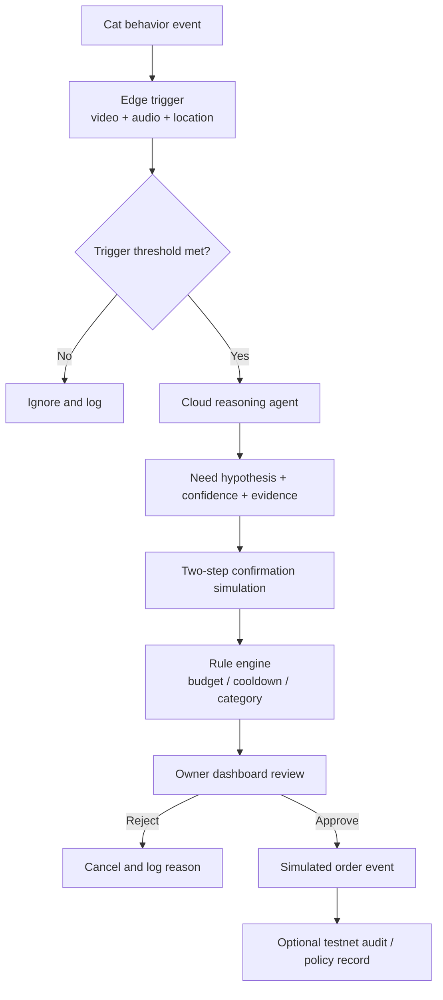

# Week 3 Ready Pack

This document consolidates the Week 3 materials for `Cat-Agent` so the repo can be used directly as WCB proof for multiple tasks.

## 1. Hackathon Direction Card

### 1.1 Basic Info

- Project: `Cat-Agent`
- Demo alias: `Pet-Agent`
- Primary track: `Z.AI｜Web3 × Long-Horizon Task`
- Secondary track: `Cobo｜Agentic Economy × Cobo Agentic Wallet`
- Participation mode: `Solo`

### 1.2 Problem Statement

Current pet devices can automate feeding or reminders, but they still fail at the hardest step: correctly understanding whether a pet actually needs something right now.

For a cat owner, the real problem is not "how to automate one more purchase," but:

- how to distinguish hunger from boredom
- how to avoid over-triggering or overfeeding
- how to keep the owner in control when a recommendation turns into a purchase action

### 1.3 Target User

- Primary user: urban cat owners who are away from home during the day
- Secondary user: platform operators managing goods, rules, and event logs
- Service subject: a single healthy household cat in the MVP

### 1.4 Core Insight

The value of this project is not "cats buy things by themselves." The value is a three-step trust loop:

1. detect likely need from multimodal signals
2. confirm intent with low-stress interaction
3. convert the result into an owner-visible, rule-guarded decision

### 1.5 Week 4 MVP

The Week 4 MVP is narrower than the full PRD. It only needs to prove one believable slice:

`event trigger -> cloud reasoning -> confirmation simulation -> risk check -> owner approval -> simulated order -> optional testnet audit`

### 1.6 Why AI x Web3

Why AI is necessary:

- multimodal signal interpretation
- uncertainty scoring
- explanation generation
- multi-step workflow orchestration

Why Web3 is still meaningful:

- bounded spending rules are a better fit for policy objects than ad hoc app flags
- auditability matters once an agent can influence commerce decisions
- testnet execution or logging is a credible way to prove that "automation remains under constraint"

## 2. Track Selection Rationale

### 2.1 Why `Z.AI` is the Primary Track

`Cat-Agent` is fundamentally a long-horizon, multi-step agent task:

- it must observe and classify noisy inputs
- it must decide whether the current signal deserves confirmation
- it must combine rules, confidence, and context
- it must produce an owner-facing explanation rather than a raw score

That is closer to a long-horizon task-orchestration problem than a pure wallet problem.

### 2.2 Why `Cobo` is the Secondary Track

The commerce boundary is where trust can fail. If the project later moves from recommendation to bounded execution, it needs:

- per-task limits
- explicit expiry
- audit fields
- owner-controlled approval boundaries

That makes `Cobo` a strong secondary alignment, but not the first slice that must ship in Week 4.

### 2.3 Why Not Lead with "Fully On-chain Pet Commerce"

Because that would widen scope in the wrong place:

- real marketplace integration is not needed to prove the concept
- real autonomous payment increases ethical and trust risk
- the biggest unknown is still recognition quality and explainability, not settlement plumbing

## 3. Week 1-2 Gap Diagnosis

### 3.1 Already Strong

- A complete PRD exists with scenario flow, risk review, roadmap, and MVP boundaries.
- A project deck already exists and is strong enough for narrative framing.
- The owner, pet, and operator roles are already clear.
- The project has an explicit non-goal: no unconstrained autonomous spending.

### 3.2 Main Gaps Before Week 4

| Gap | Why It Matters | Week 4 Fix |
|---|---|---|
| No runnable demo repo slice yet | Reviewers need something executable, not only a PRD | Build the repo skeleton and one end-to-end demo path |
| Full PRD scope is too wide | A one-week sprint cannot ship hardware, native app, and real commerce together | Compress to one mock-first workflow |
| On-chain role is still abstract | AI x Web3 positioning may feel weak without a bounded Web3 role | Add optional testnet audit or policy-object layer |
| Sponsor integration is not yet concrete | Hard to claim track fit without a clear insertion point | Define exact Z.AI / Cobo integration points |
| Validation plan is missing | Demo quality cannot be judged consistently | Add hypotheses, test cases, and acceptance criteria |

### 3.3 Gap Diagnosis Summary

The project is not blocked by "lack of ideas." It is blocked by "too much product surface." Week 4 therefore needs aggressive compression:

- keep the pet-intent workflow
- keep the owner approval boundary
- keep optional Web3 guardrails
- cut everything that requires real fulfillment or polished hardware industrial design

## 4. Proposal Memo

### 4.1 Working Title

`Cat-Agent: A multimodal pet-needs copilot with owner-visible guardrails`

### 4.2 Target User

Busy cat owners who want better visibility into what their pet likely needs, but do not trust black-box automation.

### 4.3 Real Scenario

A cat stays near the food bowl, vocalizes repeatedly, and shows attention toward the camera area. The system should not jump directly to "buy food." It should:

1. score the event
2. confirm intent through a low-stress interaction
3. evaluate budget and cooldown rules
4. present a clear recommendation to the owner

### 4.4 Minimum Feature Set

- event ingestion from video/audio or mocked sample
- two-stage intent evaluation
- confidence and evidence summary
- confirmation simulation
- rule-engine decision
- owner approval interface
- simulated order event
- optional testnet audit log

### 4.5 Validation Method

- run at least three predefined scenarios:
  - positive food-intent case
  - budget rejection case
  - low-confidence ignore case
- compare expected outcome vs actual output
- record latency, rule hit, and explanation quality

### 4.6 Main Risks

- signal quality is too noisy to produce believable confidence scores
- reviewers may question whether the confirmation step reflects real animal intent
- Web3 integration may feel bolted on if it does not clearly improve control or auditability

### 4.7 Why This Direction Is Worth Building

It avoids two traps:

- a pure smart-device demo with no real agent workflow
- a forced Web3 layer with no practical value

Instead, it focuses on one credible AI x Web3 question:

> How do you let an agent influence commerce decisions while keeping the human owner in control and the action boundary auditable?

## 5. Scope Review

### 5.1 Must Ship Before `2026-06-14`

- a repo skeleton that clearly separates edge, cloud, UI, and optional contract layers
- one demo path using recorded or mocked inputs
- a rule engine with at least budget, cooldown, and category checks
- an owner-facing explanation and approval view
- a demo script and proof links

### 5.2 Nice to Have

- live webcam input instead of only recorded clips
- simple Base Sepolia event logging
- sponsor-specific adapter stubs
- a second scenario for toy demand instead of only food demand

### 5.3 Explicitly Out of Scope for Week 4

- native iOS / Android app
- real Taobao / JD / Meituan order integration
- production hardware enclosure
- multi-pet support
- autonomous purchase without human approval
- long-term preference learning

### 5.4 Scope Decision

For the hackathon, the "owner app" becomes a responsive web dashboard, and the "hardware device" can be represented by recorded clips plus a lightweight edge trigger layer. This is the smallest path that still proves the core product idea.

## 6. Risk / Assumption Memo

| Assumption | If False | Mitigation |
|---|---|---|
| Behavior plus audio is enough for a believable first guess | The demo looks random or scripted | Use fixed scenarios and explicit evidence display |
| Two-step confirmation improves trust | Reviewers see it as gimmicky | Show before/after confidence changes and cancellation cases |
| Owners care more about control than full automation | The project feels too conservative | Frame the product as decision support first, automation later |
| Web3 is valuable as a guardrail layer | The chain part feels decorative | Limit chain scope to policy / audit where it is clearly useful |
| Mock-first demo is acceptable in Week 4 | Reviewers expect real commerce | Be explicit that fulfillment is simulated by design |

### 6.1 Highest-Risk Areas

- false confidence from weak multimodal signals
- ethical criticism around "pet consent"
- over-scoping the commerce or hardware layer

### 6.2 Risk Response

- show uncertainty instead of pretending perfect understanding
- keep owner approval mandatory
- avoid the marketing claim that pets "shop by themselves"

## 7. Weekly Review Sharing Summary

This section can be reused for `Week 3｜Weekly Review Sharing｜6.05 Live Reflection or Hackathon Idea`.

### 7.1 Sharing Topic

`Cat-Agent`: from "cute pet gadget" to a bounded AI x Web3 decision-support workflow

### 7.2 Key Reflection

The most important design decision is not adding more automation. It is narrowing where the automation stops. The project becomes more credible when it does not pretend to solve pet cognition perfectly and does not pretend autonomous payment is already trustworthy.

### 7.3 Hackathon Idea Summary

I am building a mock-first multimodal workflow for cat-need recognition and owner-visible, budget-guarded purchase recommendations. The AI part handles signal interpretation, confirmation flow, and explanation. The Web3 part is not the headline, but an optional bounded-execution or audit layer that proves how an agent can influence commerce without becoming an uncontrolled spender.

## 8. Project Flow Diagram

## 9. Technical Validation Plan

### 9.1 Hypotheses

1. A two-stage pipeline can distinguish "ignore" from "confirm" in a believable way.
2. A visible rule engine improves trust more than invisible automation.
3. A testnet audit or policy layer is enough to make the Web3 role concrete in the first demo.

### 9.2 Test Cases

| Case | Input | Expected Result |
|---|---|---|
| Positive food intent | cat near bowl + repeated meow + elapsed feeding time | enters confirmation, passes rules, creates recommendation |
| Budget rejection | high confidence snack request after budget cap hit | rule engine rejects with clear reason |
| False trigger | cat passes by bowl briefly | ignored or canceled before recommendation |

### 9.3 Acceptance Criteria

- total demo path is understandable in under 3 minutes
- each scenario has a deterministic expected result
- owner-facing view always shows:
  - evidence
  - confidence
  - rule result
  - next action
- if optional chain logging exists, it does not block the core demo

### 9.4 Evidence to Collect

- screen recording of all three scenarios
- screenshots of rule-engine outputs
- sample JSON event payloads
- optional testnet tx hash or emitted event log

## 10. Week 4 Sprint Plan

The Week 4 sprint below uses exact dates because Week 3 closes on `2026-06-07` and Week 4 runs into the final showcase window ending `2026-06-14`.

| Date | Goal | Output |
|---|---|---|
| 2026-06-08 | Freeze scope and scaffold repo | directory skeleton, README, data contracts |
| 2026-06-09 | Build edge trigger stub | sample input parser, trigger thresholds, mock events |
| 2026-06-10 | Build cloud reasoning and rule engine | scenario outputs, confidence object, rejection reasons |
| 2026-06-11 | Build owner dashboard | event review view, approval / reject flow |
| 2026-06-12 | Add optional Web3 guardrail layer | testnet audit event or policy-shaped request object |
| 2026-06-13 | Record end-to-end demo | video, screenshots, README updates |
| 2026-06-14 | Submission polish | final repo links, proof text, demo script, fallback notes |

## 11. Week 4 Ready Pack

### 11.1 Ready Checklist

- [x] project name is fixed
- [x] primary and secondary tracks are fixed
- [x] solo status is explicit
- [x] repo skeleton is defined
- [x] scope cut is explicit
- [x] sponsor integration points are identified
- [x] validation plan exists
- [ ] runnable demo code exists
- [ ] demo video exists
- [ ] optional testnet proof exists

### 11.2 Current Blocking Questions

- Is live hardware input mandatory, or is recorded input acceptable for the first demo?
- Is a testnet audit event enough for the Web3 layer, or is a stronger wallet-policy demonstration expected?
- Which sponsor integration has the highest score-to-effort ratio in one week: Z.AI orchestration or Cobo policy guard?

### 11.3 Final Week 4 Deliverables

- repo with runnable demo slice
- short demo video
- README with architecture and scenario flow
- proof bundle for WCB tasks
- optional testnet verification artifact
