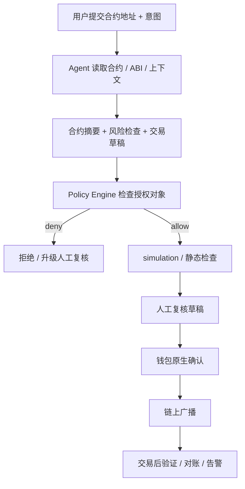
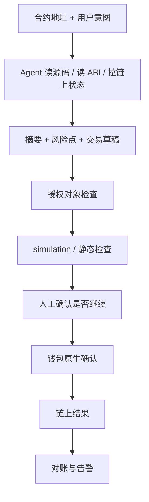

# Week 2 总交付｜方向深挖包与项目初步 Proposal

> **作者**：huahua（GitHub: [huahuahua1223](https://github.com/huahuahua1223)）
> **周次**：Week 2（2026-05-25 → 2026-05-29）
> **主仓库**：[huahuahua1223/ai-web3-learning](https://github.com/huahuahua1223/ai-web3-learning)
> **主方向**：Dev Tooling / Agent Workflow
> **候选项目名**：Contract Interaction Prep Agent

这份总交付不是从零重新写一遍，而是把 Week 2 已经完成的 A / B / C / D / F / G 六块材料收口成一份可以直接作为 proposal 评估的整合文档。

---

## TL;DR

我在 Week 2 最终选择的主方向是：

> **Dev Tooling / Agent Workflow**

我想做的不是一个会自动花钱的高自治 agent，而是一个：

> **Contract Interaction Prep Agent**  
> 一个不代签、不自动广播，但能帮助 Web3 用户完成“理解合约 -> 准备交易 -> 风险检查 -> 进入钱包确认 -> 交易后验证”的前置准备 agent。

我认为它值得做，因为它同时满足：

- **不是纯 AI 问题**：没有链上上下文、合约源码、钱包确认、可验证回执，模型只是在空谈
- **不是纯 Web3 问题**：没有 AI，普通用户面对合约源码、ABI、事件日志和权限边界，仍然很难完成理解与准备

Week 3 如果继续推进，我会把它做成一个最小可验证 MVP：

1. 输入合约地址与自然语言意图
2. 输出合约摘要、风险清单、交易草稿、simulation 结果
3. 在进入钱包前，强制经过 task-level authorization object 与人工确认边界
4. 交易后输出 expected vs actual 验证报告

---

## 1. AI × Web3 问题地图

### 1.1 六个方向总览

| 方向 | 真实用户是谁 | AI 作用 | Web3 机制 |
|---|---|---|---|
| Payment / Commerce / Settlement | 想让 agent 为 API、数据、算力、服务付费的开发者与团队 | 报价、路径选择、支付前后自动化 | 支付、结算、托管、可编程资金流 |
| Identity / Reputation / Capability / Interoperability | 需要多个 agent / 工具协作的开发者与平台 | 能力摘要、路由、协作上下文整理 | 身份、能力声明、声誉记录、标准化接口 |
| Wallet / Permission / Safe Execution | 想让 agent 帮忙准备链上动作、又不想越权的用户 | 理解意图、准备 calldata、simulation、风险提示 | 钱包、签名、授权、额度、可撤销边界 |
| Privacy / Security / Sovereignty | 关心数据泄露、prompt injection、权限扩散的用户与 builder | 风险识别、上下文最小化、异常告警 | 主权控制、权限最小化、可验证记录 |
| Dev Tooling / Agent Workflow | Web3 开发者、研究者、重度链上用户 | 解释、整理、检查、工具调用编排 | 合约源码、链上状态、回执、验证路径 |
| Governance / Coordination / Public Goods | DAO、社区组织者、公共物品项目维护者 | 总结提案、提取行动项、聚合贡献证据 | 治理流程、投票、多签、预算透明、记录可追溯 |

### 1.2 为什么最后没选另外几个方向

- `Payment / Commerce`：很有潜力，但如果没有稳定工具价值，先做支付闭环容易空转
- `Identity / Capability`：更偏标准与接口层，当前阶段不如主线问题具体
- `Wallet / Permission`：是主线里的关键约束层，但更适合作为第二层收紧边界
- `Privacy / Security`：是主线里的约束层，不适合单独成为第一入口
- `Governance / Coordination`：问题真实，但当前第一手材料与动手机会比主线少

---

## 2. 方向选择说明

### 2.1 选择结果

我最终选的是：

**Dev Tooling / Agent Workflow**

### 2.2 为什么它不是纯 AI 问题

- 如果没有链上状态、合约源码、ABI、钱包确认和回执，AI 只能做“貌似合理的解释”
- 这个项目的真正价值来自：解释结果能被链上与钱包验证，而不是模型单方面输出
- 用户关心的不是“聊懂 Web3”，而是“在真实交互前少踩坑”

### 2.3 为什么它不是纯 Web3 问题

- 如果只有钱包、浏览器、Etherscan 和 RPC，普通用户仍然很难把复杂信息变成可决策结构
- 交互前最耗时的部分往往不是签名，而是理解、整理和准备
- AI 的价值是把“信息量太大”转换成“结构化、可复核、可交给下一层的草稿”

---

## 3. 问题拆解

### 3.1 参与方

| 参与方 | 角色 |
|---|---|
| 用户 | 发起任务、审阅结果、决定是否继续、最终签名 |
| Agent | 解释、整理、检查、生成草稿、simulation、验证 |
| Policy Engine | 约束预算、对象、selector、次数、时间窗 |
| 钱包原生 UI | 最终签名前的原生确认层 |
| 链上与工具源 | 提供合约源码、ABI、状态、receipt、event logs |

### 3.2 流程

### 3.3 AI 作用

- 合约解释
- 风险清单生成
- 参数准备
- 工作流组织
- 交易后验证报告

### 3.4 Web3 机制

- 合约源码与 ABI
- 钱包签名
- task-level authorization object
- 链上可验证 receipt / event logs
- 智能账户 / policy / pact 等权限表达层

### 3.5 自动化边界

可自动化：

- 拉源码 / ABI
- 生成摘要
- 风险检查
- 交易草稿
- simulation
- 交易后验证

必须人工确认：

- 是否接受这份草稿
- 是否接受当前授权对象
- 是否签名
- 是否广播

### 3.6 验证方式

- 钱包显示值与 agent 草稿交叉核对
- tx hash / receipt / event logs 对账
- expected vs actual 检查
- 关键工具结果双源比对

### 3.7 主要风险

- 工具返回被污染
- agent 幻觉
- 默认值导致静默扩权
- 用户把草稿当结论
- 钱包确认疲劳

---

## 4. 项目初步 Proposal

### 4.1 目标用户

- 与陌生合约交互的普通用户
- 想减少“交互前准备成本”的 Web3 开发者
- 需要更快做安全前置判断的研究者

### 4.2 真实场景

一个用户看到一个新协议 / 空投 / 路由器合约，想交互，但当前会卡在：

- 不知道这个合约主要做什么
- 不知道它有哪些明显风险
- 不会自己准备交易草稿
- 不敢确认到底该不该签

### 4.3 最小功能（MVP）

1. 输入：合约地址 + 自然语言意图
2. 输出：
   - 合约摘要
   - 风险点清单
   - 交易草稿
   - simulation 结论
3. 权限层：
   - task-level authorization object
   - allow / deny / escalate
4. 验证层：
   - 交易后 receipt / event logs 对账

### 4.4 验证方式

- 用 3 个典型合约验证摘要质量
- 用 2 个真实交互意图验证草稿结构
- 用 1 次小额测试网交互验证“准备 -> 确认 -> 对账”闭环

### 4.5 主要风险

- 风险检查看起来完整，但关键工具源被污染
- 用户即使看到了摘要，也不一定真理解
- 规则太严则工具失去价值，太松则边界失控

### 4.6 可能赛道

- **主赛道**：Dev Tooling
- 次赛道：
  - Wallet / Permission
  - Security / Privacy
  - Payment / Commerce（如果未来把高级能力做成按次收费）

### 4.7 Week 3 下一步

1. 把 `contract-reader` 升级成带交易草稿与 simulation 的 MVP
2. 引入 task-level authorization object
3. 用测试网跑一条最小闭环
4. 评估是否需要把高级分析层做成收费服务

---

## 5. 参考资料清单

至少 5 条的要求，我这里列 8 条，并说明每条帮助了什么判断。

| 资料 | 链接 | 它帮助我判断什么 |
|---|---|---|
| x402 Docs | [docs.x402.org](https://docs.x402.org/introduction) | 帮我判断开放 API paywall 更适合“请求前支付”哪一段 |
| Stripe Machine Payments | [docs.stripe.com/payments/machine](https://docs.stripe.com/payments/machine?locale=en-GB) | 帮我区分平台化收单 / 退款 / 报表与开放协议支付的差别 |
| Cobo CAW Developer Quickstart | [Cobo CAW Quickstart](https://www.cobo.com/products/agentic-wallet/manual/developer/quickstart-overview) | 帮我理解 agent wallet 集成的现实入口 |
| Cobo Pact Reference | [Cobo Pact Policies](https://www.cobo.com/products/agentic-wallet/manual/reference/pact-policies) | 帮我把预算、范围、时间窗和完成条件写成明确策略对象 |
| MCP Docs | [Model Context Protocol](https://modelcontextprotocol.io/docs/getting-started/intro) | 帮我判断这个项目当前更适合“模型 -> 工具”而不是“agent -> agent” |
| A2A Repo | [A2A](https://github.com/a2aproject/A2A) | 帮我判断多 agent 协作不是当前第一优先接口 |
| ERC-4337 Docs | [docs.erc4337.io](https://docs.erc4337.io/) | 帮我理解细粒度账户能力与 agent 权限表达的方向 |
| Safe Docs | [docs.safe.global](https://docs.safe.global/home/what-is-safe) | 帮我理解资产控制层与执行层分离的重要性 |

---

## 6. 主方向深挖包

### 6.1 流程图

### 6.2 典型场景

用户想和一个陌生的空投合约交互，agent 帮他：

- 解释合约
- 识别 proxy / owner / pause / blacklist / claim 逻辑
- 生成一次 claim 草稿
- 在签名前提示哪些点必须人工确认

### 6.3 反例

一个“完全自动执行的高自治 agent”：

- 自己读取合约
- 自己判断风险
- 自己签名
- 自己广播

我不选这条路线，因为：

- 风险边界太大
- 责任不清
- 一旦工具源被污染，损失会直接落到真实资金上

### 6.4 关键风险集

- 工具源污染
- 静默扩权
- prompt injection
- 疲劳确认
- simulation 被误当成授权

### 6.5 最小验证计划

1. 选 3 个真实合约做摘要验证
2. 选 2 个真实交互场景做交易草稿验证
3. 引入 1 个 task-level authorization object 做权限闸
4. 用 1 次测试网交互验证“准备 -> 确认 -> 对账”闭环

---

## 7. Direction Backlog

目前暂时不选，但值得保留的 3 个方向：

### 7.1 Payment / Commerce / Settlement

暂不优先的原因：

- 先得证明 agent 本身有稳定交付价值
- 否则支付闭环会先于工具价值成立，变成“会收钱但不一定真有帮助”

### 7.2 Identity / Reputation / Capability / Interoperability

暂不优先的原因：

- 当前更偏标准和接口设计
- 我这周手上的第一手材料主要还是工具、权限和风险，而不是身份网络

### 7.3 Governance / Coordination / Public Goods

暂不优先的原因：

- 场景真实，但我这周更强的积累在链上交互前置准备，而不是 DAO 真实运营流程
- 这更像未来的横向扩展，而不是当前 MVP 第一条主线

---

## 8. 对应到本周已完成材料

这份总交付并不是空写，它直接由以下材料支撑：

- 问题地图与主方向：[week2-problem-map-main-direction.md](../tasks/week2-problem-map-main-direction.md)
- Payment / Commerce：[payment-commerce-flow.md](../experiments/payment-commerce-flow.md)
- Agent Profile：[agent-profile-capability-sketch.md](../experiments/agent-profile-capability-sketch.md)
- Permission Strategy：[restricted-web3-assistant-design.md](../experiments/restricted-web3-assistant-design.md)
- Threat Model：[agent-workflow-threat-model.md](../experiments/agent-workflow-threat-model.md)
- Governance Workflow：[governance-coordination-workflow.md](../experiments/governance-coordination-workflow.md)
- x402 + CAW 进阶设计：[x402-caw-payment-loop.md](../experiments/x402-caw-payment-loop.md)

---

## 9. 最终结论

Week 2 结束时，我对 AI × Web3 的判断已经比较清楚：

> 最值得继续做的，不是一个“什么都能自动做”的 agent，  
> 而是一个在明确权限边界、人工确认点和可验证记录下，真正帮用户减少链上交互前准备成本的 agent。

这条方向的优势是：

- 有真实用户痛点
- 有清晰 MVP
- 有明确风险边界
- 能自然接上 Week 3 Hackathon

如果 Week 3 要继续推进，我不会再从“我要不要做 AI × Web3”开始问，而会从更具体的问题开始：

> **我能不能把这个 Contract Interaction Prep Agent 做成一个真正可验证的最小闭环？**
