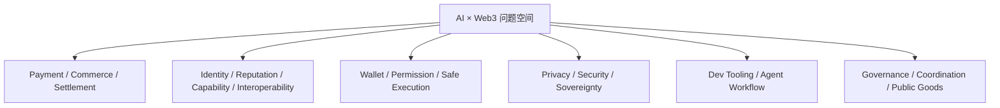

# Week 2 | 方向研究 | AI × Web3 问题地图与主方向选择

> 任务来源：WCB Week 2 Module A（20 学分）
> 完成时间：2026-05-29
> 状态：本地产物已完成，待提交到 WCB

本任务按 WCB 要求完成 3 件事：

1. 画出一张 **AI × Web3 问题地图**，覆盖至少 5 个方向，并说明每个方向中的 AI 作用与 Web3 机制
2. 从地图里选出 **2 个方向**，分别说明为什么它不是纯 AI 问题、为什么它不是纯 Web3 问题
3. 最后选择 **1 个方向作为 Week 2 主线**，后续拆解与 proposal 都围绕这一方向继续推进

---

## 1. AI × Web3 问题地图

### 1.1 总览图

### 1.2 六个方向的最小问题地图

| 方向 | 真实用户是谁 | 核心问题 | AI 在这里做什么 | Web3 在这里提供什么 |
|---|---|---|---|---|
| Payment / Commerce / Settlement | 需要让 Agent 自动购买 API、算力、数据、服务的开发者或团队 | 机器能不能像人一样发起报价、下单、结算、追踪付款结果 | 规划购买动作、比较报价、选择路径、自动化结算前后的流程 | 支付、结算、托管、公开账本、可编程资金流 |
| Identity / Reputation / Capability / Interoperability | 需要让多个 Agent / 工具协作的开发者与平台 | 如何让别人知道一个 Agent 能做什么、值不值得信、怎么被调用 | 生成能力说明、解析上下文、路由到合适工具或其他 Agent | 可验证身份、公开声明、声誉记录、标准化接口协作 |
| Wallet / Permission / Safe Execution | 想让 Agent 协助钱包与链上动作、但又不想越权的用户 | Agent 能帮忙到哪一步，哪些权限必须细到任务级 | 理解意图、准备 calldata、模拟结果、识别风险、提醒用户确认 | 钱包、签名、权限控制、预算限制、可撤销授权、执行记录 |
| Privacy / Security / Sovereignty | 关心 prompt 注入、信息泄露、权限扩散的用户和 builder | Agent 越能干，越可能碰到隐私与安全边界 | 检测风险、过滤上下文、分类敏感信息、做审计与告警 | 自主托管、权限最小化、公开可验证记录、抗审查与数据控制 |
| Dev Tooling / Agent Workflow | Web3 开发者、研究者、重度链上用户 | 文档太散、合约太难读、交易准备太繁琐、人工验证成本太高 | 解释合约、生成检查清单、调用工具、组织多步工作流、总结结果 | 链上公开状态、合约源码、交易回执、事件日志、签名与确认流程 |
| Governance / Coordination / Public Goods | DAO、社区组织者、公共物品项目维护者 | 如何把提案、讨论、预算、执行、复盘连接起来 | 总结提案、提取行动项、聚合证据、生成协调材料 | 链上/链下治理、投票、预算透明、公开记录、可追溯协作 |

### 1.3 我对六个方向的判断

- **Payment / Commerce**：适合做 Agent 经济闭环，但要求支付协议、报价、结算、争议处理一起成立，门槛高
- **Identity / Capability**：适合做标准与平台层研究，但对我当前阶段来说更偏协议理解与接口设计
- **Wallet / Permission**：和真实风险最接近，最能检验“AI 到底该替人做多少事”
- **Privacy / Security**：不是附属议题，而是所有 Agent 设计都必须同时处理的约束层
- **Dev Tooling / Agent Workflow**：最贴近我现在已经做过的事情，也最容易把已有 PoW 串成一条主线
- **Governance / Coordination**：问题真实，但当前我手里的第一手材料和实践最少

---

## 2. 我选出的 2 个候选方向

我从六个方向里先选出两个最值得继续深挖的候选：

1. **Dev Tooling / Agent Workflow**
2. **Wallet / Permission / Safe Execution**

选择这两个方向，不是因为它们名词更热门，而是因为我已经有真实材料：

- [week1-contract-reader](https://github.com/huahuahua1223/week1-contract-reader) 已经验证了“AI 帮人理解合约”的最小工具形态
- [受限 Web3 助手设计](../experiments/restricted-web3-assistant-design.md) 已经验证了“交易增强版助手”该如何设置人工确认边界
- [2026-05-25 学习日志](../daily/2026-05-25.md) 里的 Hermes 实装，已经让我实际碰到长期 Agent、默认配置、权限边界这些问题
- [2026-05-26 学习日志](../daily/2026-05-26.md) 与 [2026-05-28 学习日志](../daily/2026-05-28.md) 又把 Cobo 与 Privacy 两场直播的收获收进来了

### 2.1 候选方向一：Dev Tooling / Agent Workflow

#### 为什么它不是纯 AI 问题

- 如果只有 AI，没有链上上下文与工具调用，它最多只能泛泛解释概念，不能真正读取合约源码、交易回执、事件日志
- 这个方向真正有价值的部分，不是“让 LLM 多说一点”，而是让它基于真实链上数据、文档和工具，把多步操作组织成工作流
- 用户不是单纯想“聊 Web3”，而是想更快完成“理解合约 -> 准备交易 -> 检查风险 -> 做人工确认 -> 验证结果”

#### 为什么它不是纯 Web3 问题

- 如果只有 Web3 工具，没有 AI，普通用户面对合约源码、ABI、事件日志，仍然看不懂也不会归纳重点
- 合约交互前真正耗时的部分，往往不是链上执行本身，而是“把复杂信息翻译成人能决策的结构”
- 这个方向的关键不是再做一个区块浏览器，而是把“工具调用 + 信息解释 + 风险清单 + 验证回路”拼成一条可复用流程

### 2.2 候选方向二：Wallet / Permission / Safe Execution

#### 为什么它不是纯 AI 问题

- 如果没有钱包、签名、预算、撤销、白名单这些机制，AI 再聪明也只是建议器，没法安全地触达真实执行层
- 这个方向的难点不是模型是否会生成 calldata，而是生成之后谁来签、谁来广播、谁承担失败、谁可以撤销授权
- 权限边界、人工确认点、失败处理都不是“语言能力”能单独解决的

#### 为什么它不是纯 Web3 问题

- 如果只有钱包和权限系统，没有 AI，用户仍然需要自己理解复杂意图、拼参数、模拟结果、比对风险
- 真正让用户负担重的，是从自然语言意图到链上动作准备之间的认知与操作鸿沟
- AI 在这里的价值不是代签，而是把“难理解、难准备、难检查”的部分前移，降低用户进入复杂链上操作的门槛

---

## 3. 最终选定的 Week 2 主方向

### 3.1 结论

我最终把 **Dev Tooling / Agent Workflow** 选为 Week 2 主方向。

我当前的主问题定义是：

> **如何让 Agent 在不越权的前提下，帮助 Web3 用户完成“理解、准备、确认、验证”链上动作的整个前置流程？**

这条主线的重点不是“让 Agent 直接替我交易”，而是：

- 先帮我理解目标合约
- 再帮我准备交易参数与风险检查
- 把真正的签名与广播留给人工确认
- 最后帮我验证结果是否符合预期

### 3.2 为什么不是把 Wallet / Permission 作为主方向

`Wallet / Permission` 很重要，而且会成为我后续 `Module D` 的重点，但它更像是这条主线里的**关键约束层**，不是最适合作为第一主问题的入口。

原因有三点：

1. **我现有的成品更偏 Dev Tooling**
   [week1-contract-reader](https://github.com/huahuahua1223/week1-contract-reader) 已经是成形的工具，而不是抽象想法
2. **Wallet / Permission 更适合作为第二层收紧边界**
   也就是“这个 Agent 工作流最多能做到哪一步，哪一步必须停下来交给人”
3. **这样能自然把 Week 2 后续任务串起来**
   Module A 定主方向，Module D 补权限策略，Module F 补 threat model，最后合成 Proposal

### 3.3 当前主方向的已有基础

| 已有材料 | 它证明了什么 |
|---|---|
| [week1-contract-reader](https://github.com/huahuahua1223/week1-contract-reader) | 我已经做过“Agent 帮人读懂合约”的最小工具 |
| [experiments/agent-wallet-workflow.md](../experiments/agent-wallet-workflow.md) | 我已经画过最小 AI × Web3 workflow，知道人工确认必须插在哪里 |
| [experiments/restricted-web3-assistant-design.md](../experiments/restricted-web3-assistant-design.md) | 我已经开始把“只读助手”往“交易增强版助手”推进，并明确了不代签、不自动广播的边界 |
| [daily/2026-05-25.md](../daily/2026-05-25.md) | 我已经真实实装过 Hermes，碰到长期 Agent、默认配置和权限边界的问题 |
| [scripts/wcb-checkin-prep.sh](../scripts/wcb-checkin-prep.sh) | 我已经用 WCB Agent API 做过真实工具调用，不只是概念理解 |

---

## 4. 主方向的 7 问评估框架（简版）

### 1. 没有 AI，这个问题还存在吗？AI 实际提供什么能力？

存在。

Web3 用户面对陌生合约、复杂交易、分散文档时，本来就有理解成本和操作成本。AI 提供的不是“链上真实性”，而是：

- 信息解释
- 风险清单生成
- 多步工作流组织
- 工具调用编排
- 结果总结与异常提示

### 2. 没有 Web3，这个问题还存在吗？Web3 实际提供什么机制？

一部分存在，但会变成一般的软件助手问题，失去这一方向最关键的约束。

Web3 在这里提供的是：

- 公开链上状态
- 合约源码与 ABI
- 钱包签名
- 可验证交易结果
- 权限与资金风险的真实边界

### 3. 谁发起 / 执行 / 付款 / 接受结果 / 承担失败 / 治理仲裁？

| 角色 | 当前主方向里的对应方 |
|---|---|
| 发起方 | 用户 / 开发者 |
| 执行方 | Agent + 外部工具（Etherscan、RPC、脚本、钱包前准备层） |
| 付款方 | 用户 |
| 接受结果方 | 用户 |
| 承担失败方 | 用户为主，Agent 设计者承担工具误导与边界设计责任 |
| 治理 / 仲裁方 | 当前阶段主要是用户人工确认；未来如果产品化，可由权限策略、审计日志与团队规则承担 |

### 4. 哪些动作可以自动化？哪些必须人工确认？

**可自动化**

- 拉源码 / 拉 ABI / 拉交易回执
- 做结构化解释
- 生成风险检查清单
- 生成 calldata 预览与模拟结果
- 对比 expected vs actual

**必须人工确认**

- 连接真实钱包
- 签名
- 广播
- 放出更高额度权限
- 接受高风险链上动作

### 5. 如何验证结果？验证成本是否低于人工协调成本？

可以验证，而且验证成本通常低于纯人工阅读与协调成本。

验证路径：

- 交易 hash
- 事件日志
- 余额 / 状态变化
- 钱包弹窗显示值
- Agent 输出与链上真实结果对比

### 6. 更接近哪一层？

我当前选择的主方向最接近：

1. **Dev Tooling**
2. **Agent Workflow**
3. **Wallet / Permission 约束层**

也就是说，它不是从协议标准切入，而是从“真实用户怎么用”切入。

### 7. 如果失败，最可能因为什么失败？

- 用户其实不愿意在关键交易前相信 Agent 的解释
- 现有链上工具接口不够稳定，工作流容易断
- 权限边界设计不够细，用户不敢用
- 做出来之后只是“比区块浏览器好一点”，但没有明显节省决策时间

---

## 5. 结论与后续收敛

### 5.1 本任务结论

- 我已经完成了覆盖 6 个方向的问题地图
- 我选出了 2 个最值得继续推进的候选方向：
  - `Dev Tooling / Agent Workflow`
  - `Wallet / Permission / Safe Execution`
- 我最终把 `Dev Tooling / Agent Workflow` 定为 Week 2 主线

### 5.2 这对后续 Week 2 任务的影响

- **Module D**：从“权限边界”角度补强这条主线
- **Module F**：从“threat model / privacy boundary”角度补强这条主线
- **Final Deliverable**：把这条主线收成 Proposal 初稿

### 5.3 Direction Backlog（先不作为主线）

- `Payment / Commerce / Settlement`：留作 x402 / CAW 进阶任务的候选
- `Identity / Reputation / Capability / Interoperability`：留作未来 Agent profile / capability claim 的补充
- `Governance / Coordination / Public Goods`：目前证据与第一手实践最少，暂不作为主线

---

## 6. 可验证材料

- `week1-contract-reader` Demo：<https://week1-contract-reader.vercel.app/>
- Repo：[huahuahua1223/week1-contract-reader](https://github.com/huahuahua1223/week1-contract-reader)
- 最小工作流图：[experiments/agent-wallet-workflow.md](../experiments/agent-wallet-workflow.md)
- 受限助手设计：[experiments/restricted-web3-assistant-design.md](../experiments/restricted-web3-assistant-design.md)
- Hermes 实装与边界收获：[daily/2026-05-25.md](../daily/2026-05-25.md)
- Cobo 权限边界收获：[daily/2026-05-26.md](../daily/2026-05-26.md)
- Privacy 边界收获：[daily/2026-05-28.md](../daily/2026-05-28.md)

## 7. 提交说明建议

提交到 WCB 时，可直接提交：

- 本文档的 GitHub 链接
- 或本文档截图 + 相关 repo / demo 链接

Proof 最小组成建议：

1. 问题地图截图 / 文档链接
2. 2 个候选方向的对比结论
3. 最终主方向结论
4. 关联 PoW 链接（contract-reader / workflow / restricted assistant / Hermes daily）
